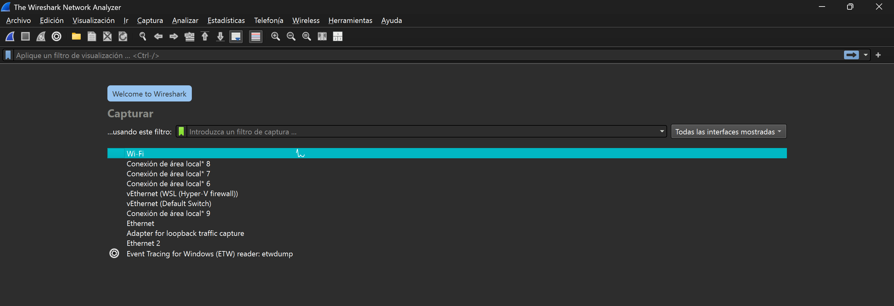
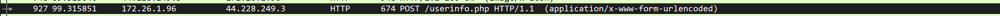

author: Hugo Flores
summary: Guía de bastionamiento de Debian 13
id: 10
categories: codelab,markdown
environments: Web
status: Published
feedback link: Un enlace en el que los usuarios puedan darte feedback (quizás creando un issue en un repositorio de git)
analytics account: ID de Google Analytics
## Instalación de WireShark
- Para instalar Wireshark, nos vamos a la página oficial `https://www.wireshark.org/`, y le damos a "Windows X64 Installer"

- Una vez descargado Wireshark, abrimos el instalador haciendo doble clic

- Ahora nos va a preguntar que componentes adicionales queremos instalar. En nuestro caso no hace falta cambiar nada, asi que se deja como está, y le damos a "Next"

- Después nos pedirá si queremos crear accesos directos para acceder rápidamente en el programa, recomiendo dejarlo puesto, y le daríamos a "Next"

- Después nos pedirá el directorio de instalación, por defecto nos lo hace en C:, aunque también se puede instalar en otro disco duro.

- Después nos pedirá si queremos instalar "Npcap", que es un programa para poder mirar puertos y dispositivos conectados en una red para buscar vulnerabilidades (durante la instalación se nos instalará los controladores necesarios para que funcione)

# Uso de Wireshark

- Al abrir por primera vez Wireshark, nos aparecerá una interfaz con todas las tarjetas de red (físicas y virtuales). Para esta práctica capturaremos el tráfico de la tarjeta WiFi.

- Ahora, para esta actividad, analizaremos el tráfico de la página web `http://testphp.vulnweb.com/login.php`. Para ello, podemos filtrar los paquetes de la red por "HTTP".

- Al ser una página con HTTP, el tráfico que se enviará a la página será en texto plano, por lo que si alguien está con Wireshark en nuestra red y introducimos nuestros datos personales, nos lo puede interceptar y ser muy peligroso para nuestra privacidad.

- Para parar la captura de tráfico de los paquetes, le damos clic al cuadrado rojo.

## Observaciones
- He visto durante el "login" simulado que he hecho en la página web, me captura la dirección IP, la MAC del ordenador y hasta el puerto utilizado para ello, además (obviamente) los datos del login y la contraseña, ya que es HTTP y no se encripta el tráfico

## Reflexiones
- La reflexión que he sacado con esta actividad es que no podemos enviar datos personales (ya sea correos o datos bancarios) a través de una WiFi insegura o pública en páginas inseguras (HTTP), ya que puede haber alguien vigilando el tráfico de red y nos puede liar muy parda, por lo que recomendaría es:

- Siempre utilizar datos móviles mientras estemos en la calle, o en la medida de lo posible, una red WiFi movil para mayor seguridad
- No rellenar formularios que parezcan sospechosos o que no tengan HTTPS.
- Realizar compras online o acciones que involucren datos sensibles en una red privada de confianza.