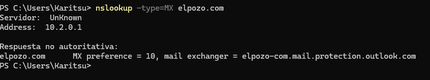
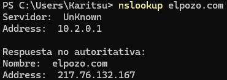
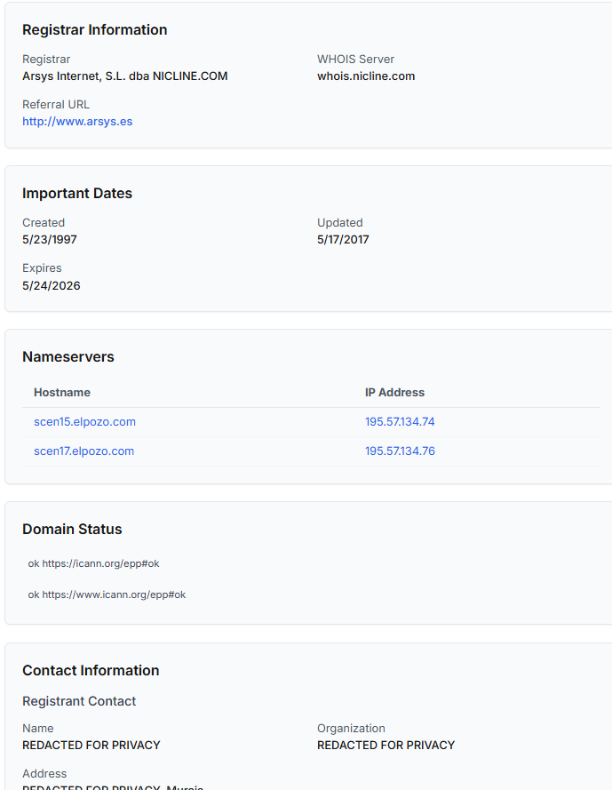
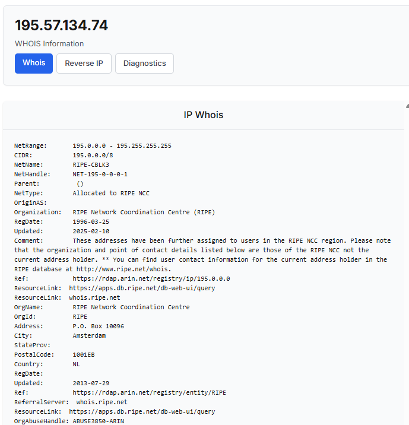
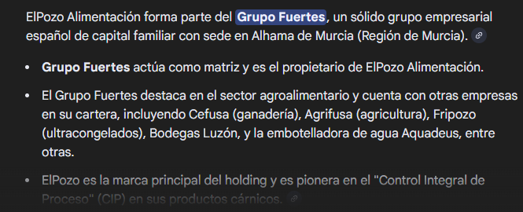
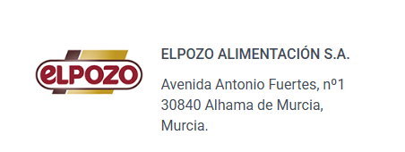
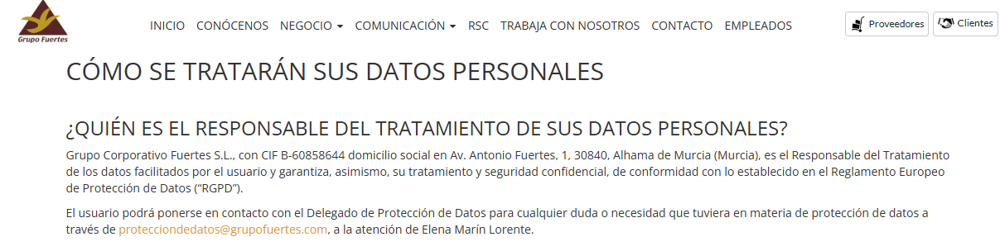

summary: Auditoría OSINT - El POZO
id: a08-dns-audit
categories: osint,audit
tags: security,networking
status: Published
authors: Karitsu
Feedback Link: https://github.com/karitsu2281/karitsu2281.github.io

# Auditoría OSINT - El POZO

## 1. Introducción
Duration: 2

### Resumen Ejecutivo
El objetivo de este informe es documentar los hallazgos de la fase de reconocimiento pasivo sobre la infraestructura tecnológica de "El POZO" (ElPozo Alimentación S.A.). El análisis se ha centrado en la identificación de activos públicos y vectores de ataque potenciales mediante fuentes abiertas (OSINT).

La infraestructura analizada presenta un modelo híbrido. Se combinan servicios modernos de correo en la nube (Microsoft 365) con un alojamiento web externo gestionado por Arsys.

El hallazgo más significativo es la detección del servidor `scen15.elpozo.com`. Este activo se encuentra alojado en una red de Telefónica, distinta a la del sitio web principal. Su ubicación y nomenclatura sugieren que podría tratarse de un punto de acceso a infraestructura interna o heredada, lo que lo convierte en un objetivo prioritario para fases posteriores de la auditoría.

### Objeto y Alcance
El presente documento tiene por objeto recopilar y analizar información pública sobre el dominio `elpozo.com`. Estos datos servirán como base para la planificación de auditorías de seguridad más profundas.

El alcance del trabajo se limita estrictamente a técnicas de reconocimiento pasivo. No se ha realizado ninguna interacción activa o intrusiva con los sistemas del objetivo, garantizando la no interferencia con sus operaciones habituales.

### Antecedentes
Esta auditoría forma parte de una evaluación de seguridad inicial. En esta etapa, es crítico identificar la superficie de ataque externa de la organización sin activar sus sistemas de defensa. La información obtenida permitirá diseñar escenarios de ataque realistas y dirigidos.

## 2. Configuración del Entorno
Duration: 2

Para la realización de esta auditoría se ha seguido una metodología de reconocimiento pasivo, asegurando cero interacción directa intrusiva con la infraestructura del objetivo.

### Herramientas Utilizadas
*   **nslookup**: Herramienta de línea de comandos para consultas DNS.
*   **whois**: Herramienta para consultar bases de datos de registro de dominios e IPs.
*   **Google Dorks**: Operadores de búsqueda avanzada para filtrar información en motores de búsqueda.
*   **Navegador Web**: Para verificación manual de hallazgos.

A continuación se detallan los procedimientos técnicos ejecutados paso a paso para la obtención de la inteligencia, permitiendo la replicabilidad de los hallazgos.

## 3. Identificación de Servicios de Correo (MX)
Duration: 5

Para determinar el proveedor de correo electrónico y evaluar la exposición a campañas de phishing dirigidas, se consultaron los registros MX del dominio.

### Procedimiento
Se ejecutó el siguiente comando para listar los intercambiadores de correo:
```bash
nslookup -type=MX elpozo.com
```

### Resultados y Análisis
El dominio utiliza Microsoft 365, evidenciado por el registro `elpozo-com.mail.protection.outlook.com`.

**Evidencia Gráfica:**


Esto indica una superficie de ataque vinculada a credenciales de Microsoft y permite enfocar las pruebas de ingeniería social hacia este entorno específico (por ejemplo, *user enumeration* en O365).

## 4. Análisis de Infraestructura Web y DNS
Duration: 5

Se analizó la infraestructura de nombres y el alojamiento del sitio web principal para comprender la topología de la red expuesta.

### Procedimiento
Se realizaron consultas para identificar los servidores de nombres (NS) y la dirección IP del servidor web principal (A):
```bash
nslookup -type=NS elpozo.com
nslookup elpozo.com
```

### Resultados y Análisis
El sitio web corporativo `www.elpozo.com` resuelve a la dirección IP `217.76.132.16`, alojada en Arsys Internet S.L. La gestión DNS también está delegada en este proveedor.

**Evidencia de Resolución:**


Al tratarse de un hosting comercial externo, es probable que cuente con medidas de seguridad gestionadas, reduciendo la probabilidad de éxito de ataques directos a la infraestructura base.

## 5. Descubrimiento de Activos Anómalos
Duration: 10

Mediante técnicas de búsqueda pasiva (Google Dorks) y resolución de nombres, se buscó identificar subdominios que pudieran revelar sistemas olvidados o de administración.

### Procedimiento
Se emplearon operadores de búsqueda avanzada para filtrar el sitio principal y localizar otros subdominios indexados:
```text
site:elpozo.com -www
```

**Evidencia de Búsqueda:**


Posteriormente, se verificó la resolución de los hallazgos:
```bash
nslookup scen15.elpozo.com
```

### Resultados y Análisis
Se identificó el subdominio `scen15.elpozo.com`, que resuelve a la IP `195.57.134.74`.

**Evidencia del Hallazgo de scen15:**


A diferencia de la web principal, este activo reside en la red de **Telefónica de España**. Esta discrepancia es altamente relevante. Podría indicar una conexión a oficinas físicas (fibra óptica con IP fija), una VPN antigua o un servidor de desarrollo expuesto. Este activo debe ser considerado el punto más débil detectado en esta fase.

## 6. Información de Registro (Whois)
Duration: 3

Se consultaron las bases de datos de registro para confirmar la titularidad de los activos y obtener puntos de contacto.

### Procedimiento
Se realizaron consultas Whois sobre el dominio y las direcciones IP identificadas:
```bash
whois elpozo.com
whois 195.57.134.74
```

### Resultados y Análisis
Los registros públicos confirman que ElPozo Alimentación S.A. es el titular.

**Evidencia Whois:**


Se identificaron direcciones de contacto como `protecciondedatos@grupofuertes.com`, lo que revela la pertenencia al "Grupo Fuertes" y sugiere que la auditoría podría extenderse lateralmente a la entidad matriz.

**Detalle Adicional:**


## 7. Conclusiones
Duration: 2

La organización "El POZO" expone una superficie de ataque heterogénea. La migración del correo a la nube reduce riesgos de infraestructura propia, pero introduce nuevos vectores de ataque social.

La web corporativa parece estar bien aislada en un proveedor de hosting. Sin embargo, el servidor `scen15.elpozo.com` representa el punto más débil detectado. Al estar fuera del paraguas de seguridad del hosting principal, es el candidato ideal para pruebas de penetración más agresivas en el futuro.

## 8. Anexo: Resumen de Comandos
Duration: 1

Para facilitar la replicación de los pasos, aquí se presenta un resumen de los comandos utilizados.

| Objetivo | Comando / Dork | Herramienta |
| :--- | :--- | :--- |
| **Registros MX** | `nslookup -type=MX elpozo.com` | nslookup |
| **Registros NS** | `nslookup -type=NS elpozo.com` | nslookup |
| **Resolución A** | `nslookup elpozo.com` | nslookup |
| **Subdominios** | `site:elpozo.com -www` | Google |
| **Whois IP** | `whois <IP>` | whois (web/cli) |

### Capturas del Proceso
A continuación se muestran capturas adicionales del proceso de ejecución.

**Proceso General (1):**


**Proceso General (2):**

