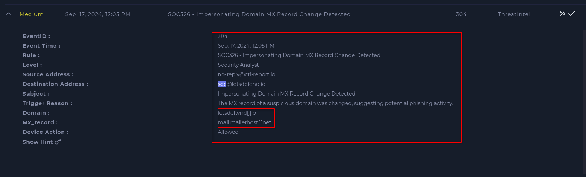
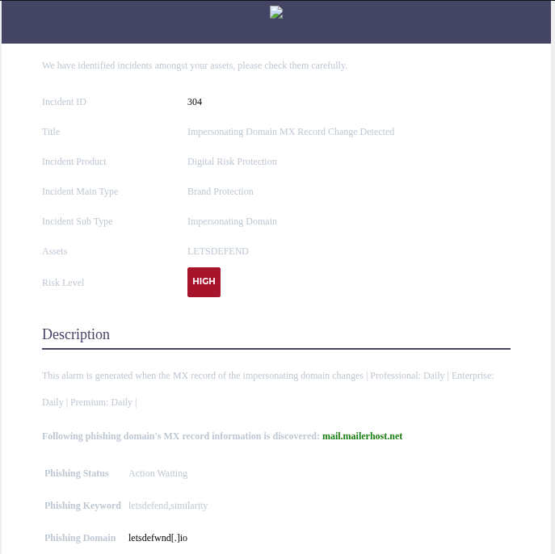
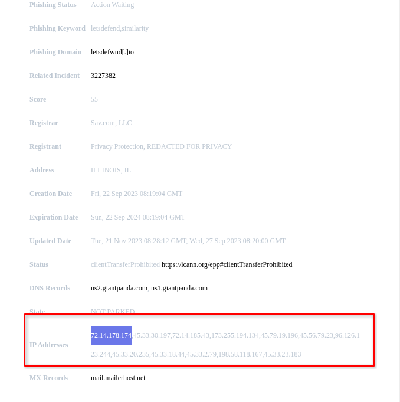
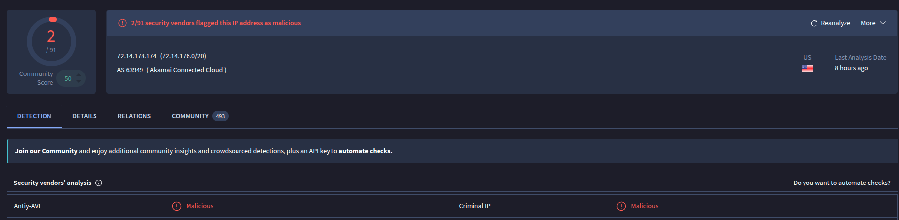
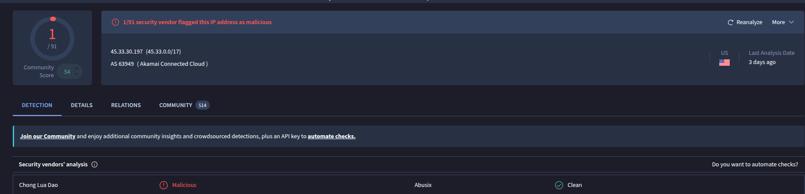
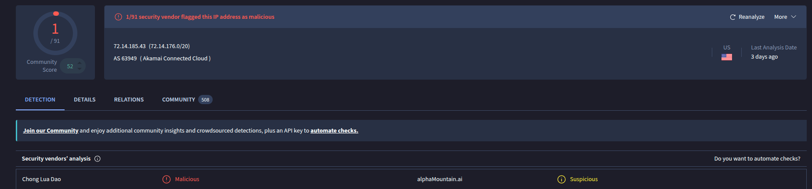
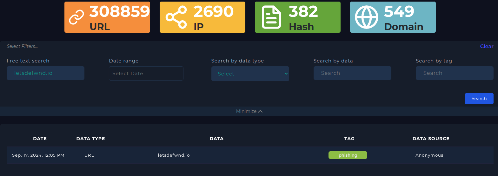
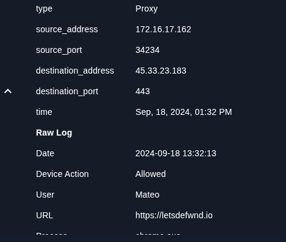

## Writeup SOC-326 (Impersonating Domain MX Record Change Detected)
Lo primero que he hecho, es ir a la sección de Email Security, y buscar un correo del 17 de septiembre de 2024 en busca de la posible suplantación de dominio de correo.

Después, buscando por dicha fecha, he encontrado el correo con todos los detalles, a las 12:05, e incluye un dominio de correo, el dominio asociado al phising, y una lista de IPs asociadas a dicho sitio web, que al revisarla con VirusTotal, me salen de que son maliciosas. También revisé el dominio de correo, y al ser uno legítimo de Amazon, obviamente no salió nada malicioso.

*mensaje del correo*

*resultados de VirusTotal de las IPs (solo pongo algunas, ya que son muchisimas)*

Además, al ir a la sección de "Threat Intel", y buscar el dominio asociado, me salta que es de tipo phishing dicho dominio.

Conclusión: Hay una URL asociada a dicho sitio, es maliciosa (al ser de tipo phishing), fue entregado al SOC como advertencia para monitorizar dicho dominio, y revisando los logs, cayeron usuarios en dicho enlace de phising, llamado Mateo

