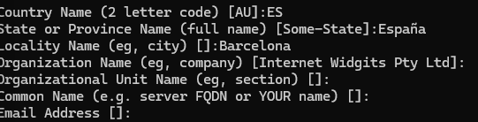
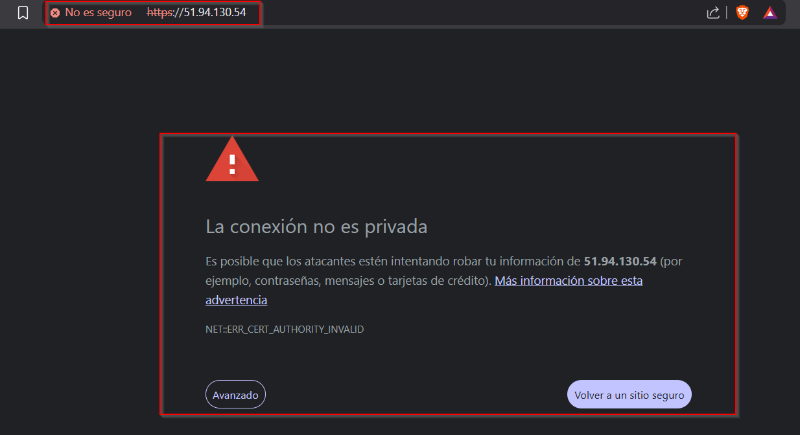
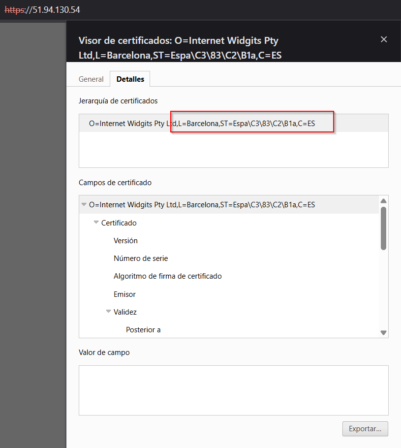
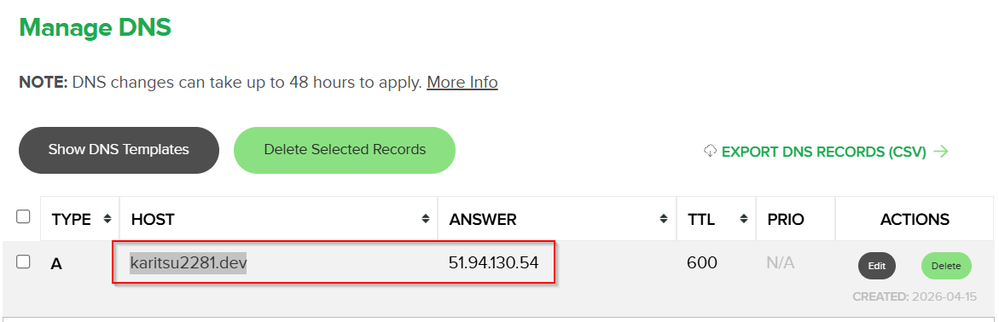
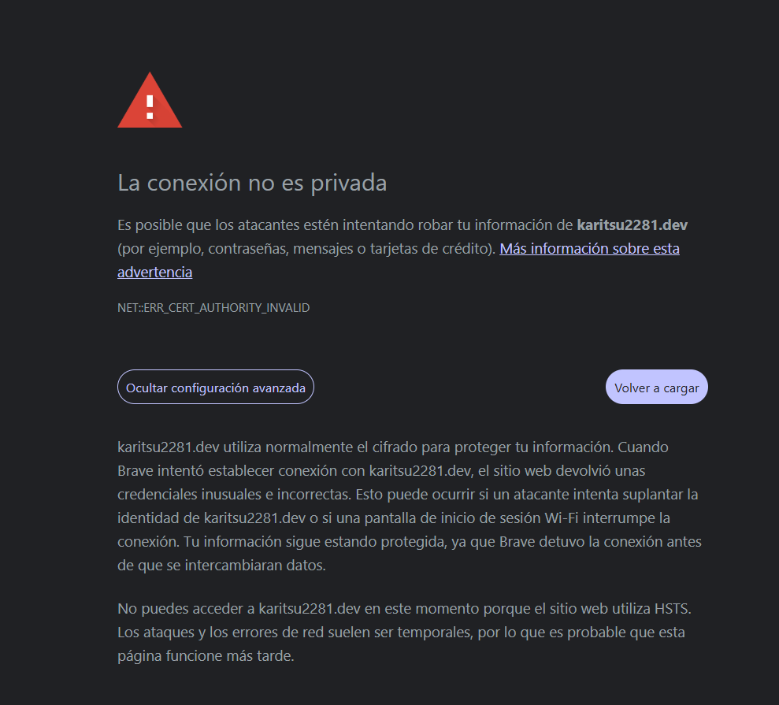
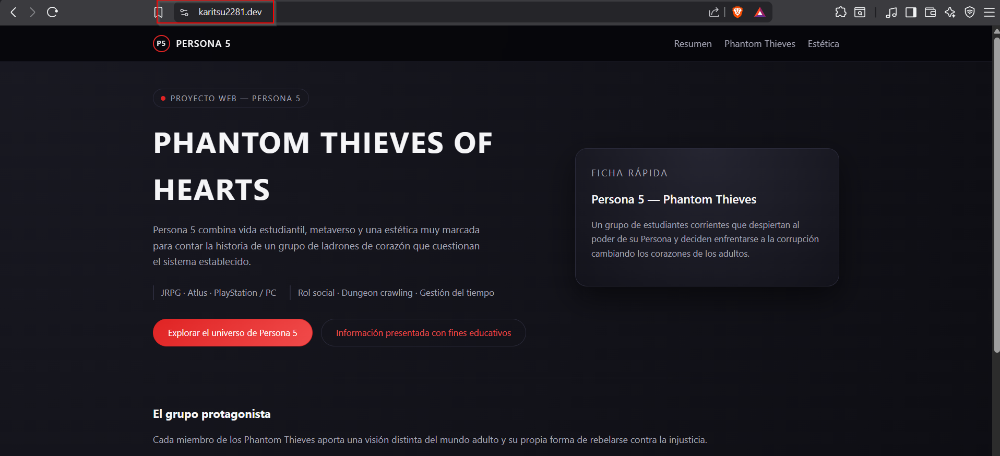
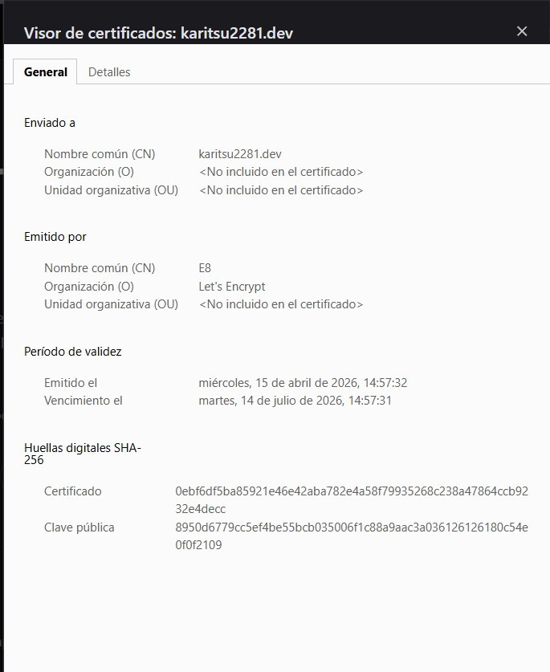

# Parte 2 — Servidor Web con HTTPS

## Entorno

- **Servidor**: AWS EC2 — Ubuntu Server 24.04
- **Web server**: Apache2
- **Dominio**: karitsu2281.com
- **IP pública**: 51.94.130.54

---

## 1. Instalación y configuración de Apache2

Pasos realizados para instalar el servidor web y servir la página de prueba.

```bash
sudo apt update
sudo apt install apache2 -y
sudo systemctl start apache2
sudo systemctl enable apache2
```


Ahora habría que cambiar las reglas del firewall de AWS para permitir el tráfico en el puerto 80 y 443. De momento, como no tengo configurado HTTPS ni tengo certificado, no lo haré hasta más adelante.


Dato importante: Además del firewall que tiene la instancia de AWS por defecto, he puesto otro firewall en el propio servidor por seguridad (ufw). Por lo tanto, para que funcione el servidor, tengo que tener abiertos los puertos en ambos firewalls.


Como se puede ver en la imagen, tengo abiertos los puertos 22, 80 y 443. Pero hasta que no tenga configurado HTTPS ni el certificado, no lo abriré en el firewall de AWS.

Al entrar por el puerto 80 desde un navegador a la IP, podemos ver que se muestra correctamente la página de prueba de la instancia.


---

## 2. Certificado autofirmado (Self-Signed)

### Generación del certificado

Lo primero que vamos a hacer, es activar el módulo SSL de Apache.

```bash
sudo a2enmod ssl
sudo systemctl restart apache2
```

Después, vamos a crear el certificado autofirmado de SSL en nuestra instancia con el comando "openssl".

```bash
sudo openssl req -x509 -nodes -days 365 -newkey rsa:2048 -keyout /etc/ssl/private/apache-selfsigned.key -out /etc/ssl/certs/apache-selfsigned.crt
```

Nos pedirá unos pequeños datos para rellenar. Esto es opcional, pero para este proyecto, he puesto unos cuantos datos falsos para ver cuando entremos al navegador con el certificado autofirmado.



Después, vamos a crear un pequeño sitio web de pruebas para confirmar que el certificado autofirmado funciona. Como quiero hacer un pequeño sitio web un videojuego llamado "Persona", vamos a hacer un nuevo sitio web virtual con Apache.

```bash
sudo nano /etc/apache2/sites-available/persona.conf
```
Después, en la configuración, ponemos el mínimo necesario para que funcione el sitio web.

```apache
<VirtualHost *:443>
   ServerName persona
   DocumentRoot /var/www/persona

   SSLEngine on
   SSLCertificateFile /etc/ssl/certs/apache-selfsigned.crt
   SSLCertificateKeyFile /etc/ssl/private/apache-selfsigned.key
</VirtualHost>
```
Después, vamos a crear la carpeta /var/www/persona y vamos a crear un archivo index.html con el siguiente contenido:

```html
<!DOCTYPE html>
<html>
<head>
    <title>Persona</title>
</head>
<body>
    <h1>Persona</h1>
</body>
</html>
```

Ahora, vamos a activar el sitio virtual y vamos a recargar Apache.

```bash
sudo a2ensite persona.conf
sudo systemctl reload apache2
```

Después, vamos a abrir el puerto 443 en el firewall de AWS, ya que en pasos anteriores no lo habilitamos al no tenerlo configurado.


Perfecto, al abrir el puerto 443 en el firewall de AWS, ya podemos acceder al sitio web con el certificado autofirmado.
### Captura — Error en el navegador

Al entrar al sitio web, obviamente, nos saldrá un error de que el certificado no es válido al ser autofirmado. Pero como podemos ver, el sitio web funciona correctamente.




¡Perfecto! Tenemos signos de vida del sitio web con HTTPS. Ahora vamos a ver los detalles del certificado autofirmado.


### Captura — Datos del certificado autofirmado

Podemos ver que al entrar por los detalles del certificado autofirmado, podemos ver los datos introducidos en pasos anteriores,además del propio emisor.



**Observaciones:**

- Emisor (CA): Yo mismo / hostname del servidor
- Fecha de emisión: 15/04/2026
- Fecha de expiración: 15/04/2027
- Firmado por entidad reconocida: ❌ No

---

## 3. Certificado válido — Let's Encrypt

### Proceso de obtención

Ahora vamos a obtener un certificado válido para nuestro sitio web. Para ello, vamos a usar Certbot, una herramienta que nos permitirá obtener certificados de Let's Encrypt de forma gratuita y automática.

```bash
sudo apt install certbot python3-certbot-apache -y
```

Antes de nada, debemos tener un dominio apuntando a nuestra IP pública. En mi caso, como tengo GitHub Pro, he podido usar name.com para obtener un dominio adecuadamente.



Una vez que el dominio esté apuntando a nuestro servidor, ejecutamos Certbot de manera automática para nuestro servidor web Apache:

```bash
sudo certbot --apache -d karitsu2281.com
```
(Asumiendo que el dominio configurado sea `karitsu2281.com`. Sólo hace falta seguir los pasos en pantalla.)

Al entrar con el dominio en el navegador antes de hacer la validación de Let's Encrypt, podemos ver que reconoce el servidor, pero al usar un certificado autofirmado, nos da error de seguridad. Sin embargo, es suficiente para comprobar su correcto funcionamiento.



### Captura — Datos del certificado válido en el navegador

Al seguir los pasos de Certbot, nos pedirá una serie de datos, como el correo electrónico y el dominio. Una vez introducidos los datos, nos pedirá si queremos redirigir el tráfico de HTTP a HTTPS, a lo que le diremos que sí.
Y al entrar con el certificado recién firmado de Certbot, ya podremos acceder al sitio web sin ningún problema. (PD: He cambiado la estética del sitio web para que se vea más profesional y no genérico.)






**Observaciones:**

- Emisor (CA): Let's Encrypt / R11
- Fecha de emisión: 15/04/2026
- Fecha de expiración: 14/07/2026
- Firmado por entidad reconocida: ✅ Sí

---

## 4. Análisis y comparación

| Campo | Certificado autofirmado | Certificado Let's Encrypt |
|---|---|---|
| Autoridad emisora (CA) | Desconocida (yo mismo) | Let's Encrypt (R11) |
| Reconocido por el navegador | ❌ No | ✅ Sí |
| Confianza del navegador | Aviso de seguridad | Candado verde |
| Cifrado del tráfico | ✅ Sí | ✅ Sí |
| Validación de identidad | ❌ No | ✅ Sí (Domain Validation) |
| Coste | Gratuito | Gratuito |
| Renovación | Manual | Automática (certbot) |
| Uso recomendado | Entornos de prueba / internos | Producción / acceso público |

### Conclusión

El cifrado funciona en ambos casos, pero la diferencia clave es la **cadena de confianza**: un certificado autofirmado lo firma el propio servidor, sin que ninguna CA reconocida lo avale, por lo que el navegador no puede verificar la identidad del servidor y lanza un aviso de seguridad. Let's Encrypt actúa como CA reconocida globalmente, lo que permite al navegador validar la identidad del servidor sin avisos.