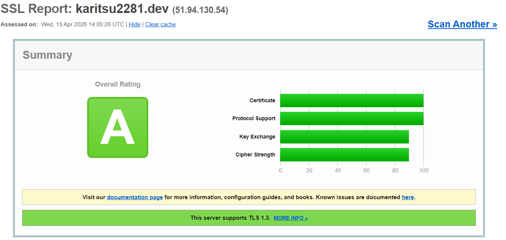
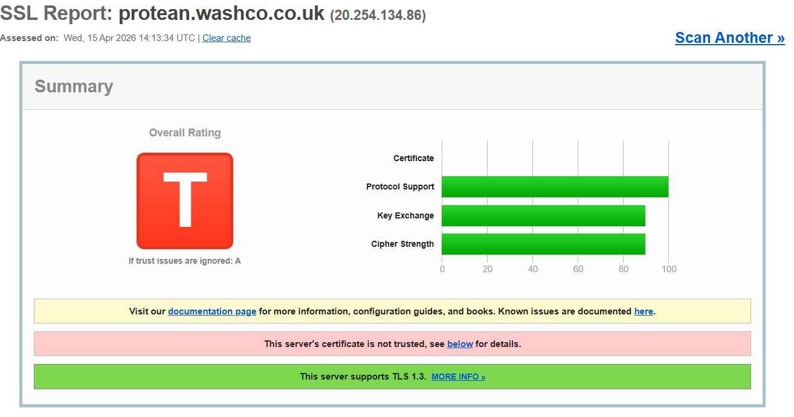
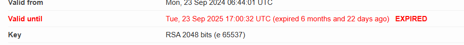
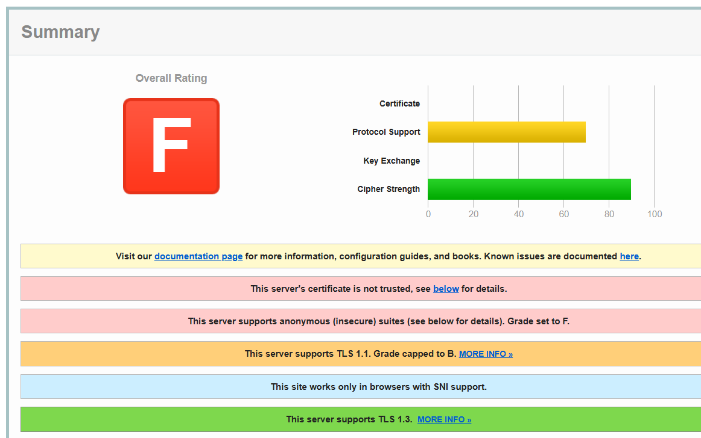
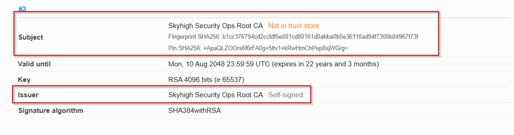
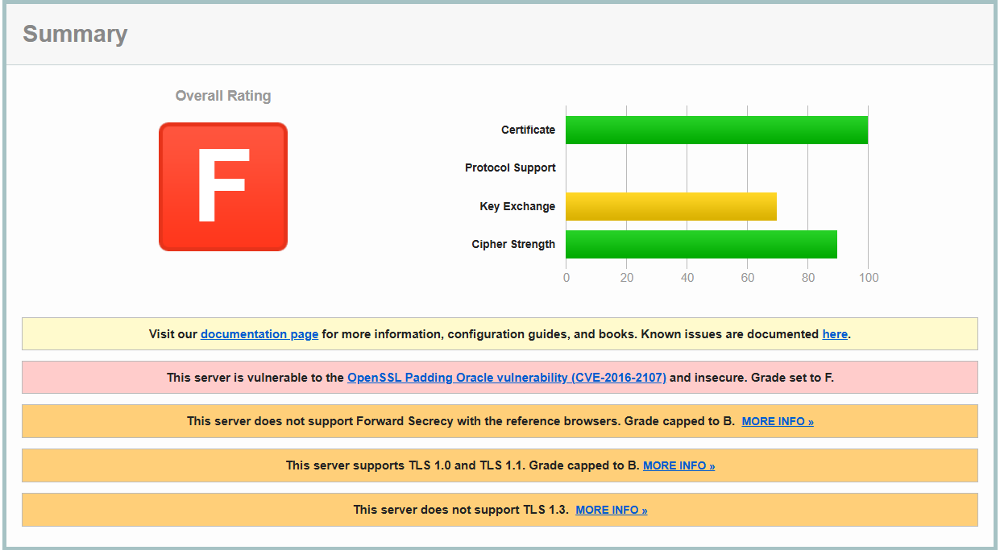

# Parte 3 — Análisis de Certificados SSL

## Herramienta utilizada

[SSL Labs — Qualys SSL Test](https://www.ssllabs.com/ssltest/)

---

## 1. Análisis del certificado propio karitsu2281.dev

### Captura del resultado en SSL Labs

### Nota obtenida: A

### Motivos que lo validan como certificado correcto

- **Emisor reconocido**: El certificado está firmado por Let's Encrypt, una CA incluida en los trust stores de todos los navegadores principales.
- **Cadena de confianza completa**: SSL Labs verifica que la cadena de certificados (leaf → intermedio → root) está correctamente configurada.
- **Dominio validado**: El CN y el SAN del certificado coinciden con el dominio solicitado.
- **Protocolo seguro**: Se usa TLS 1.2 / TLS 1.3, sin SSLv3 ni TLS 1.0/1.1.
- **Sin vulnerabilidades conocidas**: No presenta POODLE, BEAST, Heartbleed, etc.
- **Vigente**: La fecha de expiración no ha sido alcanzada.

---

## 2. Certificados erróneos localizados

---

### Certificado 1 — Certificado caducado

**Sitio**: protean.washco.co.uk

**Tipo de error**: Certificado expirado (`NET::ERR_CERT_DATE_INVALID`)

**Captura del análisis**:

**Explicación**:

Los certificados tienen una fecha de expiración para limitar el tiempo durante el cual una clave comprometida podría ser explotada. Cuando un certificado supera esa fecha, el navegador no puede garantizar que siga siendo válido ni que la clave privada no haya sido comprometida, por lo que bloquea la conexión.

---

### Certificado 2 — Certificado autofirmado / CA no reconocida

**Sitio**: wgcs.skyhigh.cloud

**Tipo de error**: CA no reconocida (`NET::ERR_CERT_AUTHORITY_INVALID`)

**Captura del análisis**:

**Explicación**:

El certificado no ha sido firmado por ninguna CA incluida en el trust store del sistema operativo o el navegador. Sin ese aval de tercero de confianza, el navegador no puede verificar la identidad del servidor y considera la conexión potencialmente peligrosa.

---

### Certificado 3 — Criptografía debil

**Sitio**: n.jmpsa.or.jp

**Tipo de error**: Criptografía debil (`NET::ERR_CERT_COMMON_NAME_INVALID`)

**Captura del análisis**:

**Explicación**:

El certificado tiene una vulnerabilidad de OpenSSL (CVE-2016-2107), de calificación 5,9, además de solo soportar TLS 1.0 y TLS 1.1, por lo que no tiene calificación alguna en criptografía (aunque en cifrado tiene bastante buena calificación).

---

## 3. Tabla resumen de errores

| # | Tipo de error | Causa principal | Riesgo |
|---|---|---|---|
| 1 | Caducado | Fecha de expiración superada | Clave posiblemente comprometida |
| 2 | CA no reconocida | Autofirmado o CA privada | No se puede verificar identidad |
| 3 | Nombre no coincide | CN/SAN distintos al dominio | Posible MITM o mala config |