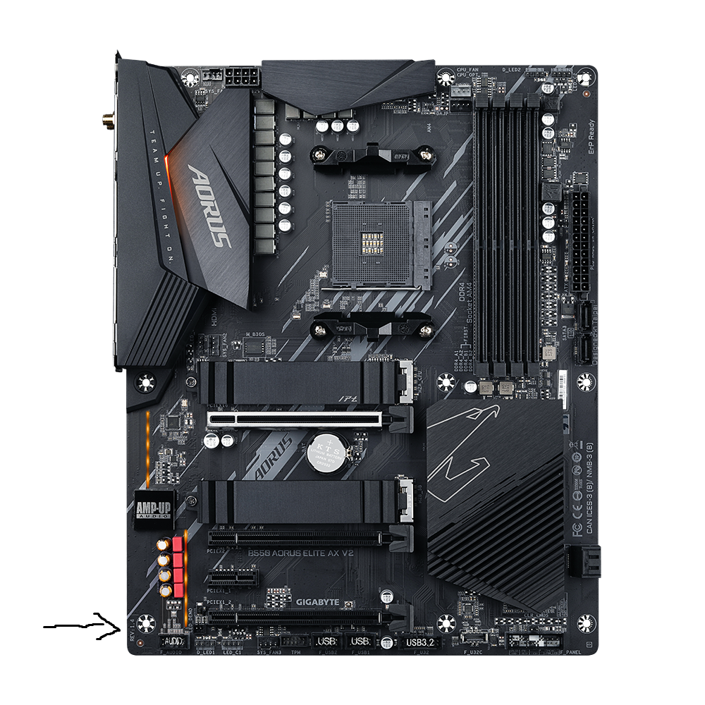

author: Hugo Flores
summary: Guía de bastionamiento de PC de alto rendimiento con placa base Aorus B550 Elite AX V2
id: identificador-unico-del-codelab
categories: codelab,markdown
environments: Web
status: Published
feedback link: Un enlace en el que los usuarios puedan darte feedback (quizás creando un issue en un repositorio de git)
analytics account: ID de Google Analytics
# Guia de bastionamiento para PC de alto rendimiento con placa base Aorus B550 Elite AX V2
---

## Materiales necesarios

- PC con placa base Aorus B550 Elite V2 AX
- Memoria USB formateada en FAT32
- Teclado USB (obviamente, entonces como entras a la BIOS...)
- Conexion a Internet para actualizar la BIOS

---

## Paso 1: Obtención y actualizacion de BIOS

1. Lo primero que vamos a hacer, es identificar que revisión tiene la placa base. Se puede buscar en la propia caja de la placa base o en la misma placa, en mi caso seria REV 1.5 (foto ejemplo de placa base con REV 1.4 marcado en la flecha)

   

2. Descargamos la ultima versión de la BIOS de nuestra placa de la pagina oficial de Gigabyte (es importante elegir la revisión de nuestra placa base para evitar errores en la instalacion):
   - https://www.gigabyte.com/es/Motherboard/B550-AORUS-ELITE-AX-V2-rev-15

   

3. Extraemos el archivo BIOS a nuestra memoria USB FAT32 vacía.

   

4. Reiniciamos el ordenador y entramos en BIOS machacando la tecla `Supr` tan pronto como reiniciemos.

5. Abrimos la utilidad **Q-Flash** pulsando `F8`. o haciendo clic en el menú de la BIOS,"Q-Flash". 

En este modelo de placa base también podemos actualizar directamente la placa base sin necesidad de CPU con un botón llamado "Q-Flash Plus"

6. Elegimos el archivo de la BIOS actualizada desde la USB y esperamos a que se actualice.

---

## Paso 2: Configuración de Secure Boot

1. Entramos nuevamente a la BIOS (machacando `Supr` al iniciar el ordenador).

2. Vamos a la pestaña **Boot**, antes activando el modo avanzado.

3. Desactivamos  `CSM Support` (establece en `Disabled`).

4. En **Boot > Secure Boot**:
   - Activa `Secure Boot` en `Enabled`.
   - Normalmente suele tardar un poco en activarse, en el caso de que no se pueda, le daríamos clic a "Restore Factory Keys" y debería activarse sin problema.

---

## Paso 3: Contraseñas de BIOS

En la pestaña **System**:
   - Establece una contraseña segura en `Administrator Password`.
   - Configuramos `User Password` para acceso restringido.

---

## Paso 4: Activación de TPM (fTPM)

1. Ve a la pestaña **Peripherals** o **Settings**.
2. Busca `AMD CPU fTPM` y ponla en `Enabled`.
3. Guarda cambios.

---

## Paso 5: Desactivación de hardware no utilizado

En **Peripherals** o **Settings > IO Ports**:
   - Desactiva `HD Audio Controller` si tienes tarjeta de sonido externa.
   - Desactiva `Onboard WIFI` o `Onboard LAN` si no los usas.
   - Desactiva puertos SATA no usados.

---

## Paso 6: Verificación Final en Windows

1. Ejecuta `msinfo32` y verifica:
   - `Estado de arranque seguro`: Activado.
2. En el Administrador de dispositivos, confirma que el dispositivo `Módulo de plataforma segura 2.0 (TPM)` esté presente.

---

# ¡Listo! Tu BIOS está ahora bastionada para seguridad y rendimiento máximos.

---

**Nota:** Mantén siempre actualizada la BIOS y revisa periódicamente la configuración para nuevas opciones de seguridad. No modifiques opciones avanzadas sin conocer sus efectos para evitar inestabilidad.

---

## Créditos y Fuentes

- Página oficial Gigabyte B550 AORUS ELITE AX V2
- Guías sobre Secure Boot y TPM para placas Gigabyte
- Mejoras recomendadas en foros tecnológicos y videos tutoriales

---

Fin del CodeLab.
