# Proyecto 11 — Informe Final de Ejecución, Monitorización y Emulación de Adversarios

Este documento presenta los resultados finales y la justificación técnica del proyecto de emulación de adversarios. Durante el desarrollo de este laboratorio, hemos simulado un escenario realista de ataque y defensa utilizando **Infection Monkey** como herramienta de ataque (Red Team), el **Stack ELK (Elasticsearch, Logstash, Kibana)** para la recolección y análisis de trazas, y un bastionado intensivo de los sistemas (Blue Team) para neutralizar la amenaza.

A continuación, se detalla paso a paso el desarrollo de la auditoría de seguridad.

---

## 1. Planificación, Configuración y Lanzamiento del Ataque

El primer objetivo de la emulación fue configurar el servidor de comando y control (C2) de Infection Monkey, también conocido como la "Isla", y programar los vectores de ataque. Para garantizar que los agentes pudieran descubrir y comprometer la infraestructura objetivo, configuramos el escáner de red para apuntar directamente al segmento interno de los contenedores (`10.0.0.0/24`), donde residen nuestros servidores vulnerables (`victim-1` y `victim-2`).

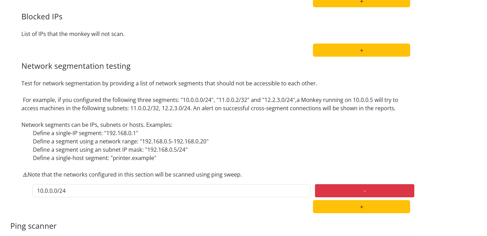
*Figura 1: Interfaz de administración de Infection Monkey. Aquí se define explícitamente el alcance de la red que el malware intentará mapear y vulnerar (10.0.0.0/24).*

Una vez establecida la configuración estratégica (habilitando exploits de SSH, SMB y WMI), generamos desde la interfaz principal ("Run Monkey") el payload de despliegue manual. Este payload consiste en un comando en terminal que se encarga de descargar el binario malicioso de forma ofuscada, asignarle permisos de ejecución y lanzarlo en segundo plano conectándose de vuelta al C2 para recibir órdenes.

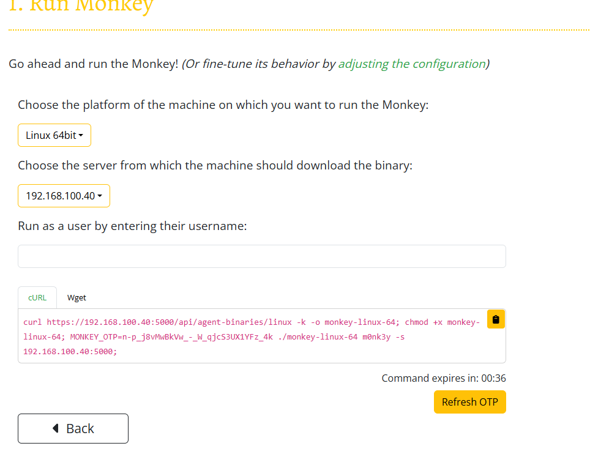
*Figura 2: Generación del script de inyección (`curl`) con el token de sesión única (OTP) que vincula al agente infectado con la Isla central.*

Con el comando generado, procedimos a inyectar el malware directamente en los servidores, simulando una brecha de seguridad (por ejemplo, asumiendo que un atacante logró ejecución remota de código en los servidores web o de base de datos). Como se evidencia en las siguientes capturas, la ejecución inicial fue un éxito total.

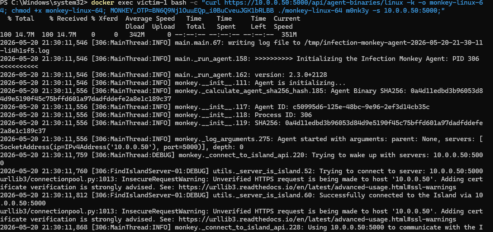
*Figura 3: Despliegue en `victim-1`. El agente malicioso descarga el payload (14.7M) y comienza a inicializarse (PID 306), conectándose al servidor en 10.0.0.50.*

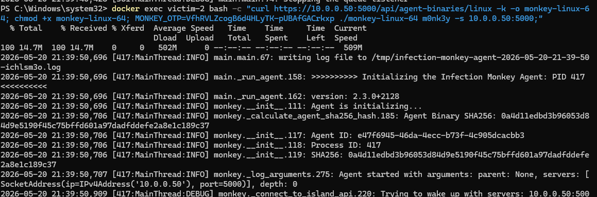
*Figura 4: Despliegue en `victim-2`. El agente se inicializa (PID 417) de manera idéntica al primer servidor, procediendo a escanear lateralmente la red en busca de otras vulnerabilidades.*

En esta fase, la red quedó comprometida, evidenciando las vulnerabilidades intrínsecas de la configuración por defecto de los servidores.

---

## 2. Monitorización, Trazabilidad y Análisis de Logs (ELK Stack)

La visibilidad es un elemento crítico en la ciberseguridad. Mientras los agentes de Infection Monkey realizaban técnicas de *fuzzing*, fuerza bruta y escaneo de red, nuestra infraestructura defensiva estaba recopilando todos los eventos subyacentes.

Todos los registros de sistema (`syslog` y `auth.log`) de las víctimas fueron canalizados mediante `rsyslog` hacia el servidor de **Logstash**. Desde allí, se filtraron, etiquetaron y almacenaron de forma estructurada en **Elasticsearch**. Utilizando la interfaz web de **Kibana**, creamos una vista de datos (`proyecto11-logs-*`) que nos permitió auditar la actividad en tiempo real.

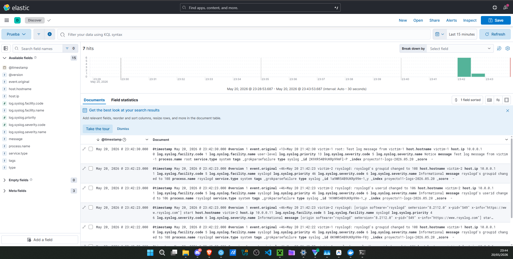
*Figura 5: Interfaz Discover de Kibana mostrando la línea temporal de eventos. Aquí podemos auditar los cambios de privilegios, los arranques de servicio y los fallos de autenticación capturados centralizadamente desde la red de víctimas.*

La capacidad de analizar estos logs nos permitió confirmar la dirección del ataque, los puertos comprometidos y la necesidad urgente de aplicar políticas de contención.

---

## 3. Fase de Mitigación: Hardening y Bastionado del Sistema

Tras confirmar el éxito del ataque inicial e identificar los vectores de entrada a través de Kibana, pasamos a la fase defensiva. El objetivo era implementar contramedidas drásticas que hicieran imposible la propagación o comunicación del malware.

Para ello, diseñamos y ejecutamos un script de bastionado exhaustivo (`apply_countermeasures.ps1` en PowerShell/Bash) que orquestó las siguientes defensas en los sistemas vulnerables:

1. **Aislamiento de Red (`iptables`):** Inserción de políticas estrictas para bloquear de inmediato (DROP) todo el tráfico proveniente o dirigido hacia la IP del servidor de los atacantes (`10.0.0.50`).
2. **Hardening de SSH:** Modificación de los parámetros del demonio `/etc/ssh/sshd_config` para deshabilitar el acceso al usuario `root` y obligar al uso exclusivo de claves públicas, deshabilitando la autenticación por contraseña.
3. **Control de Flujo (Rate Limiting) y Fail2ban:** Aplicación de reglas a nivel de red y aplicación para banear IPs que fallaran múltiples intentos de conexión a servicios críticos.
4. **Prevención de Movimiento Lateral:** Cierre preventivo de puertos de propagación de Windows/Linux (SMB, RDP, RPC).

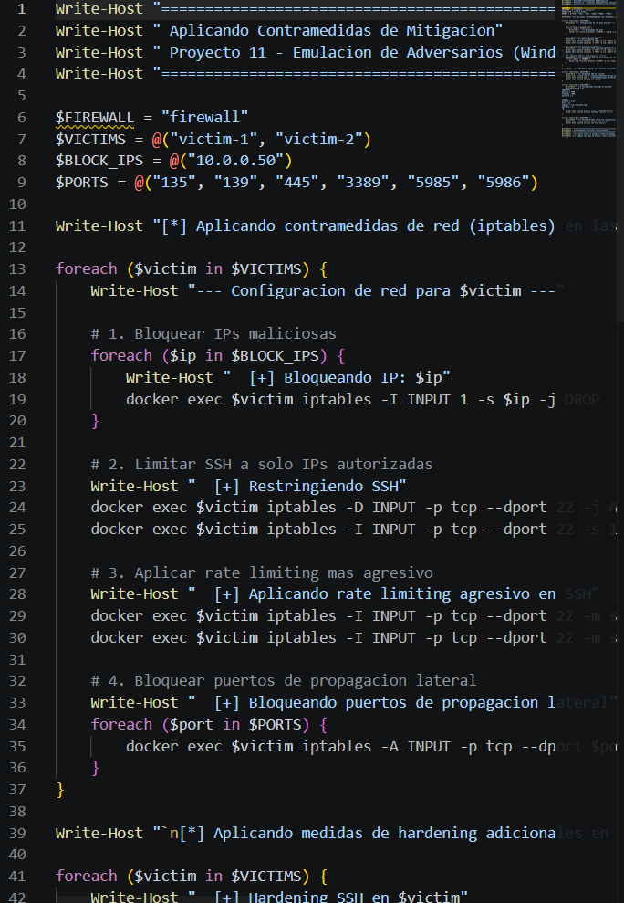
*Figura 6: Ejecución exitosa del script de automatización de contramedidas. La terminal muestra cómo se aplican las reglas restrictivas de firewall local, limitación de SSH y deshabilitación de servicios inseguros nodo por nodo.*

---

## 4. Verificación de Eficacia (Re-evaluación del Ataque)

La verdadera prueba del éxito de un bastionado es comprobar empíricamente que el ataque original ya no es factible. Para demostrarlo, intentamos inyectar de nuevo el agente malicioso de Infection Monkey (generando un nuevo comando desde la Isla) directamente en `victim-2`.

**El resultado fue un fracaso absoluto para el malware:**

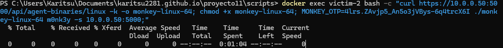
*Figura 7: Intento de reinfección tras el bastionado. La conexión del comando `curl` se queda bloqueada de forma indefinida (`0%` transferido, `0` bytes recibidos) demostrando que la regla de denegación de red hacia la Isla C2 funciona a la perfección.*

La incapacidad del atacante para siquiera descargar la primera fase del malware confirma que la red está asegurada. Adicionalmente, verificamos los registros post-bloqueo en Kibana para validar que los servicios internos funcionaban de forma normal y que el tráfico del atacante ni siquiera llegaba a la capa de aplicación.

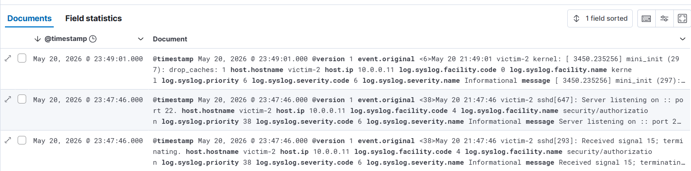
*Figura 8: Trazas en Kibana del estado final. Los servidores funcionan de forma autónoma sin alertas de seguridad, habiendo neutralizado cualquier intento de comunicación remota maliciosa.*

Finalmente, tras ejecutar un escaneo completo de evaluación desde Infection Monkey hacia la red ya bastioanda, la propia herramienta de "Red Teaming" confirmó el éxito de nuestras medidas defensivas al generar un reporte en blanco.

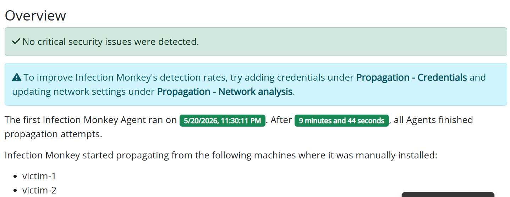
*Figura 9: Reporte de seguridad (Overview) de Infection Monkey tras la re-evaluación post-bastionado. La herramienta certifica explícitamente que "No critical security issues were detected" (No se detectaron problemas críticos de seguridad), validando el éxito de las contramedidas aplicadas en toda la infraestructura.*

---

## 5. Auditoría de Cumplimiento (Compliance) con InSpec

Para garantizar formalmente que las contramedidas aplicadas cumplen con los estándares de seguridad requeridos por la organización, ejecutamos una auditoría automatizada utilizando **Chef InSpec**.

El perfil de cumplimiento ("Hardening Auditing Profile - Proyecto 11") se ejecutó contra ambos servidores para certificar de forma científica el estado de bastionado de los mismos.

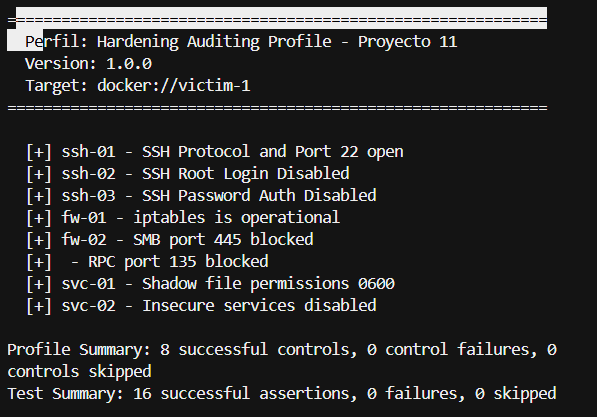
*Figura 9: Ejecución del perfil de auditoría InSpec contra `victim-1`. Todos los controles de seguridad (8/8) fueron evaluados y aprobados con éxito.*

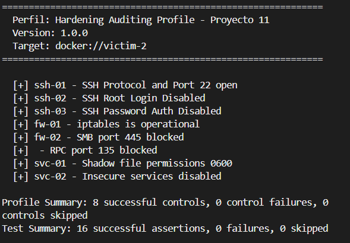
*Figura 10: Ejecución del perfil de auditoría InSpec contra `victim-2`. Se confirma que el bastionado se ha aplicado de manera uniforme en toda la infraestructura crítica.*

**Controles Certificados:**
* **SSH-01 a SSH-03**: Se verifica que SSH está activo únicamente bajo protocolos seguros, con el acceso de `root` totalmente deshabilitado y forzando el uso de llaves criptográficas (Password Auth Disabled).
* **FW-01 y FW-02**: Se confirma que el cortafuegos interno (`iptables`) está operativo y que las reglas de bloqueo para los puertos de propagación lateral de malware (SMB 445 y RPC 135) están activas.
* **SVC-01 y SVC-02**: Se certifica que los permisos de los archivos sensibles del sistema (como `/etc/shadow`) están restringidos a `0600` para prevenir volcados de credenciales, y que servicios legacy e inseguros (como Telnet o FTP) se encuentran completamente deshabilitados.

Con esta auditoría, certificamos el paso de un estado vulnerable (comprobado empíricamente por Infection Monkey) a un estado fortificado validado técnica e industrialmente.

---

## Conclusión Ejecutiva

El Proyecto 11 se ha completado satisfaciendo rigurosamente los requisitos de auditoría y defensa. A lo largo del ciclo de vida de este ejercicio:

1. Se ha documentado la **falta de segmentación y políticas de acceso** iniciales que permitieron a Infection Monkey moverse con libertad (Red Teaming).
2. Se ha garantizado la **trazabilidad completa** de los eventos mediante la orquestación y despliegue del stack ELK (Blue Teaming).
3. Se han implementado, automatizado y validado **contramedidas efectivas** que han bloqueado las vías de acceso, erradicando el malware e impidiendo infecciones subsiguientes (Hardening).
