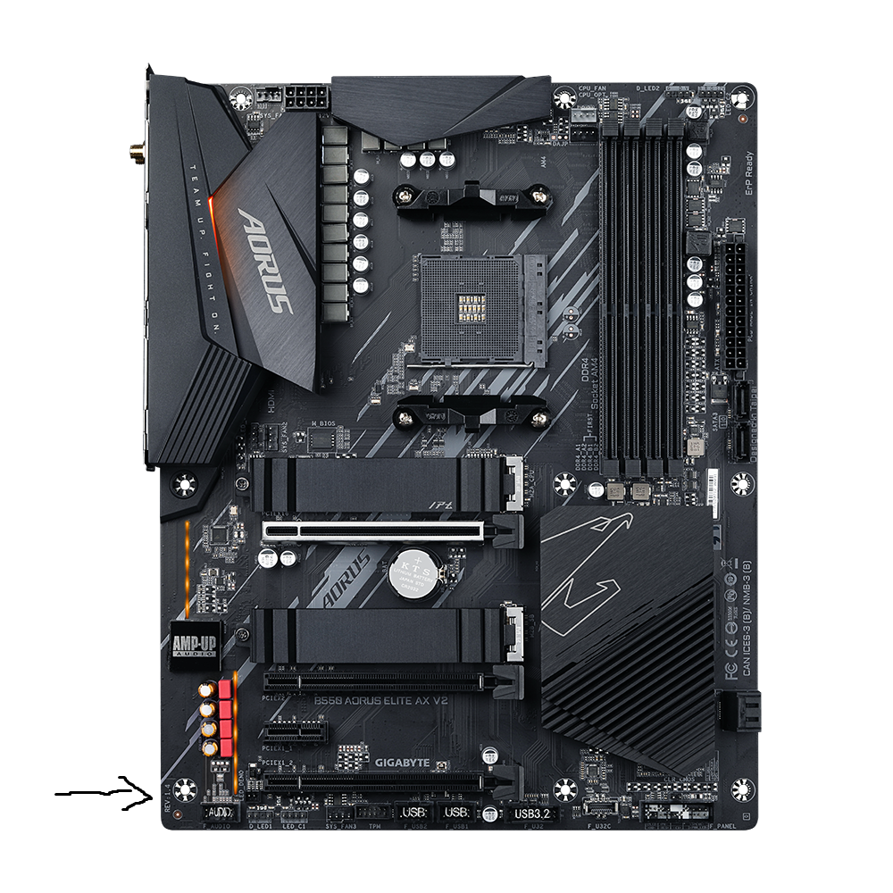
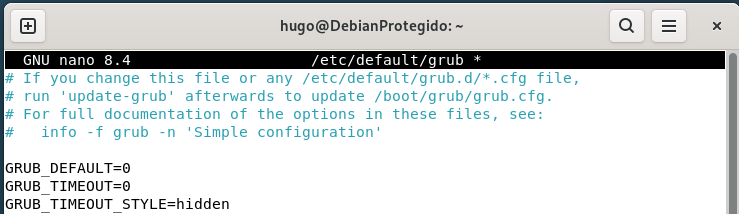

author: Hugo Flores
summary: Guía de bastionamiento de Debian 13
id: 1
categories: codelab,markdown
environments: Web
status: Published
feedback link: Un enlace en el que los usuarios puedan darte feedback (quizás creando un issue en un repositorio de git)
analytics account: ID de Google Analytics
# Guia de bastionamiento de arranque de Debian 13
---

## Paso 1: Ocultación del menú de arranque
Lo primero que vamos a hacer es ocultar el menú de arranque, para evitar que atacantes o usuarios sin conocimientos que modificen parámetros de arranques, reduciendo la posibilidad de que puedan acceder a funciones adicionales, como el arranque como root.
Para ello, introducimos en la terminal:
```
sudo nano /etc/default/grub
```




Modificamos y/o añadimos las líneas siguientes:

```
GRUB_TIMEOUT_STYLE=hidden
GRUB_TIMEOUT=0
```



Guardamos los cambios con (`Ctrl + O` y Enter) y salimos de nano (`Ctrl + X`). 


Actualizamos la configuración de GRUB:
```
sudo update-grub
```


**Resultado:** El menú se oculta. Solo aparece usando `Esc` durante el arranque.

---

## Paso 2: Configurar contraseña de arranque 

Configurar la contraseña del GRUB hace que usuarios no autorizados no puedan editar opciones del arranque, acceder a la consola o modificar entradas para obtener acceso root (init=/bin/bash).

Generamos el hash de la contraseña con el siguiente comando:

```
sudo grub-mkpasswd-pbkdf2
```


Introducimos la contraseña del GRUB y copiamos el hash en un lugar seguro.


Ahora, editaremos el script de configuración personalizado con el usuario de Debian y el hash recién creado:

```
sudo nano /etc/grub.d/40_custom
```

Añadimos al final (sustituimos `usuario` y `hash`):

```
set superusers="usuario"
password_pbkdf2 usuario hash
```


Guardamos, cerramos y actualizamos GRUB:

```
sudo update-grub
```


**Resultado:** Habría que introducir usuario/contraseña para cualquier acción administrativa en GRUB, hasta para acceder al sistema operativo.


---

## Paso 3: Copia de seguridad de la configuración del arranque

Antes de modificar nada del GRUB, crearemos copias de seguridad. Se realiza en el caso de que hagamos errores al modificar las opciones de arranque y poder recuperar rápidamente la funcionalidad del equipo. Si se comete un error en el GRUB, puede dejar el sistema inutilizable.

Se realizan con:

```
sudo cp /etc/default/grub ~/grub-backup-default
sudo cp -r /etc/grub.d ~/grub-backup-grub.d
```


**Para restaurar:**

```
sudo cp ~/grub-backup-default /etc/default/grub
sudo cp -r ~/grub-backup-grub.d/* /etc/grub.d/
sudo update-grub
```


---

## Paso 4: Otras opciones de seguridad

- **Contraseña BIOS/UEFI:** Como en el proyecto anterior, podemos introducir la contraseña de administrador y usuario de la BIOS para mayor seguridad ante intento de acceso físico.

- **Secure Boot:** Evita de que el atacante pueda ejecutar software no firmado o malicioso, reduciendo la superficie de ataque


- **Cifrado completo de disco:** Seleccionamos durante la instalación ("LVM cifrado"), y también pudiendose separar en particiones, en el caso de Debian

---