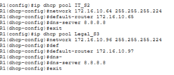
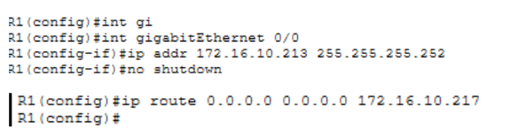
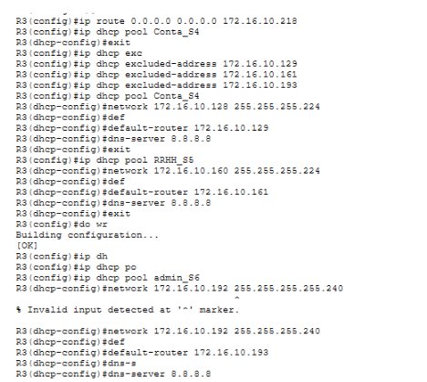

summary: ¿Cómo hacer un enrutamiento estático y configurar la red VLAN en una red en Cisco Packet Tracer?
id: enrutamiento-estatico-vlan-cisco
categories: Redes
tags: cisco, packet-tracer, vlan, enrutamiento
status: Published
authors: Grupo 4
Feedback Link: https://github.com

# ¿Cómo hacer un enrutamiento estático y configurar la red VLAN en una red en Cisco Packet Tracer?

## Introducción
Duration: 2

Para esta guía hemos decidido usar una red de que conforma tres routers(de la marca Cisco) interconectados entre sí, 6 switches (de cada departamento), dos servidores con los servicios esenciales para su funcionamiento y para probar la conectividad de la red, un PC con Ubuntu 22.04

## Configuración de los routers
Duration: 10

### Router 1

Lo primero que vamos a hacer es cambiar el hostname de nuestro router para poder identificarlo fácilmente y evitar confusiones al realizarlo en el resto de routers.

Para ello, introducimos en la terminal "enable", para ponernos en modo administrador, "conf t" para ponernos en modo configuración y para establecer el nombre, introducimos "hostname R1". Repetimos lo mismo en los dos routers restantes, con "R2" y "R3", respectivamente


Después, vamos a asignar direcciones IP para poder comunicarnos con los switches de la red asociada a R1. Para ello, introducimos en la terminal "interface gigabitEthernet1/0", para conectarlo al Switch 1


Ahora, vamos a configurar la dirección IP que vamos a asignar al puerto para comunicarnos con el switch. Para ello, introducimos en la terminal "ip addr 172.16.0.1, que sería la puerta de enlace, y 255.255.255.192 como la máscara". Para activar el puerto después de configurar las IP, introducimos "no shutdown".


Después, repetimos el mismo proceso para el switch 02 y 03, pero con sus respectivas IP asignadas en el VLSM, además de sus mask asignadas por número de equipos.


**Nota importante:** Para no perder el progreso de configuración de los routers, introduciremos en la terminal "do wr", para guardar los cambios en la memoria.

Ahora, para mayor comodidad al asignar las direcciones IP, vamos a configurar un pool DHCP para ahorrarnos mucho tiempo en asignarlas manualmente.

Lo primero que vamos a hacer es introducir en la terminal "ip dhcp excluded-access 172.16.10.x". Lo que hace este comando es cuando se asignan las direcciones DHCP, no las tiene en cuenta para evitar conflictos de direcciones. Lo normal es usar las puertas de enlace asignadas en las interfaces.


Ahora, para configurar el DHCP Pool, vamos a introducir en la terminal "ip dhcp pool "nombre del Pool". Lo recomendado es ponerlo al nombre del switch asignado, junto con el departamento para mayor facilidad de configuración.

Cuando estemos dentro de la configuración, introducimos "network 172.16.10.0 255.255.255.192", para asignar las IP que usará DHCP para asignarlo a los equipos, y la puerta de enlace con "default-router 172.16.10.1" para comunicarse correctamente con el router, y opcionalmente podemos asignar un servidor DNS (lo normal sería con el DNS de Google, que sería 8.8.8.8) con "dns-server 8.8.8.8"


Repetimos el mismo proceso para el resto de switches del router con sus respectivas IP y masks.



Ahora, vamos a configurar la ruta para poder comunicarse con los otros routers. Para ello introducimos en la terminal "ip route 0.0.0.0 0.0.0.0 172.16.10.217". Lo que hace este comando es dar una ruta para comunicarse con los routers, debido al tipo de distribución que tiene nuestra empresa, con este comando sirve para conectarse al resto de routers. Es importante configurar la interfaz que conecta el router con el resto para que el comando funcione correctamente, se realizaría con "ip addr".



### Router 2

Al ser el router central, transmite el internet de la nube NAT al resto de la red, por lo que el proceso va a ser algo diferente al resto de routers. Lo primero que vamos a hacer es configurar la interfaz que coge el Internet de la nube.

Para ello, configuraremos el comando "ip addr" para que coga automáticamente la dirección IP de la nube. Se realizaría con "ip addr dhcp". También usaremos el comando "ip nat outside" para que enrute los paquetes hacia la red.


Ahora, configuraremos el resto de las interfaces para que se conecten con ambos routers correctamente. Se realizarían con los comandos "int" "ip addr" y "no shutdown", como en el resto de routers.

Ahora, lo más laborioso de este router, sería configurar todas las rutas para que se comunique correctamente con los routers.


### Router 3

La configuración sería muy similar al router 1, pero aplicando las otras IP de los switches.




## Configuración de las Vlans
Duration: 8

En este apartado debemos usar los siguientes comandos para introducir las Vlans en los respectivos Switches con los siguientes comandos:

### Crear VLAN
Tendrá que repetirse para cada VLAN

```
enable
configure terminal
VLAN 20
name vlan20
```

### Asignar VLAN
Tendrá que repetirse para cada VLAN

```
enable
configure terminal
interface fastethernet 0/1
switchport access VLAN 30
```
(asigna la VLAN a la interfaz)

### Asignar mode trunk

```
enable
configure terminal
interface gigabitethernet 6/1
switchport mode trunk
switchport trunk allowed VLAN 10,20,30
```
- `switchport mode trunk`: sirve para transportar tráfico de múltiples VLAN por un único enlace
- `switchport trunk allowed VLAN 10,20,30`: sirve para especificar las VLAN permitidas en la interfaz

## Seguridad en los switches
Duration: 5

Para añadir seguridad en los switches usamos los siguientes comandos:

```
enable
configure terminal
interface FastEthernet 0/2
switchport port-security
switchport port-security maximum 1
switchport port-security mac-address sticky
switchport port-security violation shutdown
```

**Descripción de los comandos:**
- `enable`: Modo privilegiado
- `configure terminal`: accedemos a la terminal
- `interface FastEthernet 0/2`: Indicamos el puerto por el que no queremos que lleguen
- `switchport port-security`: accedemos al modo seguridad para los puertos
- `switchport port-security maximum 1`: Le damos un único dispositivo (Aprenderá una MAC)
- `switchport port-security mac-address sticky`: Al mandar un paquete aprenderá la dirección del dispositivo conectado
- `switchport port-security violation shutdown`: Al conectar un dispositivo a la mac se apague el puerto y solo el administrador pueda reactivar el puerto

## Sub-interfaz en los routers
Duration: 5

### Creación de las subredes en un interfaz
Tendrá que repetirse para cada VLAN

```
enable
configure terminal
interface gigabitethernet 0/0/.10
description VLAN20
encapsulation dot1q 20
ip address 192.16.10.65 255.255.255.224
```

**Descripción de los comandos:**
- `interface gigabitethernet 0/0/.10`: Crea una interfaz virtual que permite enrutar VLANs entre sí
- `encapsulation dot1q 20`: Indica por que VLAN se va a enrutar el tráfico de dicha VLAN
