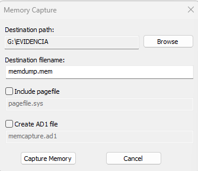

author: Hugo Flores
summary: Guía de bastionamiento de Debian 13
id: 1
categories: codelab,markdown
environments: Web
status: Published
feedback link: Un enlace en el que los usuarios puedan darte feedback (quizás creando un issue en un repositorio de git)
analytics account: ID de Google Analytics
# Guia de adquisición forense con FTK Imager en una máquina Win7
---

## Paso 1: Identificación del equipo
Lo primero que vamos a hacer, es realizar fotografías del entorno, como:
- Estado de la máquina (si está encendida o mal apagada)
- Procesos de la máquina
- Conexiones de red
- Dispositivos conectados

Ejemplo:
```
Fecha/Hora: 11/11/2025, 09:30 CET
Ubicación: Sala servidores S-203, Edificio Principal
Descubierto por: JHugo Flores Molina (DNI: 12345678A)
Circunstancias: Alerta IDS Snort ID-2025-8847


```

Después registraremos las especificaciones de la máquina

| Característica      | Detalle                             |
| ------------------- | ----------------------------------- |
| Sistema Operativo   | Windows 7 Professional 64-bit |
| Capacidad Disco     | 32GB                                |
| Memoria RAM         | 1GB                                 |
| Sistema de Archivos | NTFS                                |
| Hipervisor          |  VirtualBox                          |
| Estado Inicial      | Sistema mal apagado, red encendida   |

---

## Paso 2: Adquisición de evidencias volátiles

## 2.1 Preparación del entorno
Inmediatamente después de que encendamos nuestro equipo, para la adquisición de la memoria volátil (RAM), conectaremos una memoria USB que contenga el programa "FTK Imager", siguiendo la norma NIST SP 800-86, siguendo el principio de orden de volatibildad.

La memoria RAM contiene evidencias importantes que se perderían al apagar bien el equipo: procesos, conexiones, claves de cifrado y código malicioso.

## 2.1.1 Uso de la memoria USB
Es importante de que nuestro USB esté cifrado con un algoritmo fuerte (AES-256) y que esté libre de cualquier tipo de malware, para evitar alterar las pruebas de la máquina. Para esta adquisición utilizaremos un SSD PNY CS900 de 240 GB conectado a un convertor SATA a USB, revisado ante amenazas y cifrado con Veracrypt.

## 2.2 Captura de memoria RAM
En este caso, nuestra máquina da problemas al ejecutar FTK Imager, debido a la falta de librerías esenciales para su funcionamiento, además de probar con otros programas como Dumpit y no tener suerte, se explicará el procedimiento para poder replicarse correctamente. Después se probó con Volatility3 y se pudo sacar los procesos de la máquina correctamente

- Insertamos nuestra memoria USB sin ejecutarla inmediatamente
- Navegamos a la carpeta instalada de FTK Imager


- Ejecutamos FTK Imager.exe como administrador (clic derecho + Ejecutar como administrador )


- Ahora, para capturar la memoria de la máquina (si funcionara...), nos vamos a File > Capture Memory


 - Al seleccionar la opción, nos pedirá que eligamos la ruta para el dump de la memoria. Al elegirlo, le damos clic a Capture Memory y esperamos a que se realize.



- Al terminar la captura, nos debería generarse un archivo .dmp, y con Votality, podemos saber los procesos que ejecutaba la máquina. Para ello, introducimos en el cmd:
```
 .\vol.py -f .\FORENSIC_10-Snapshot1.vmem windows.pslist

 ```
 Nota: El proceso se realiza muy rápido, por lo que se recomienda grabar pantalla para poder capturar correctamente los procesos (para ello es la opción windows.pslist)


- MUY IMPORTANTE: Hay que realizar un hash inmediato de la RAM obtenida para garantizar que no se alteren los datos con su uso (ya sea con MD5 o SHA-256)


---

## Paso 3: Adquisición de evidencias no volátiles

## 3.1 Disco duro
## 3.1.1 Apagado controlado del sistema
Antes de proceder con la adquisición del disco, ejecutaremos un apagado ordenado del sistema para evitar problemas de corrupción de datos Desde CMD con privilegios de administrador ejecutaremos:​

```
shutdown /s /t 0
```

Documentaremos la hora exacta del apagado (11/11/2025 19:37 CET). Evitaremos el uso del botón de apagado físico o cierre abrupto de la VM que podría perder datos en caché.​

## 3.1.2 Adquisición forense bit-a-bit
Para realizar la adquisición es imprescindible hacer una copia bit-a-bit del disco duro para asegurarnos de que la evidencia original no sea modificada. Utilizaremos FTK Imager como herramienta para crear una imagen completa del disco virtual de 32 GB

- Iniciaremos FTK Imager en nuestra estación forense y seleccionaremos File > Create Disk Image. En el cuadro de diálogo "Select Source", elegiremos la opción "Physical Drive" para capturar el disco completo sector por sector incluyendo espacio no asignado y archivos eliminados.
- En nuestro caso utilizaríamos "File Image", ya que al tratarse de una VM, debemos coger la imagen de la propia máquina. Se haría con "Add Evidence Item - Image File", elegimos la imagen de la VM a analizar y al dar clic a Finish, nos debería salir el disco completo

- Ahora, para hacer la copia completa del disco, nos vamos a "File - Create Disk Image", elegimos la imagen de nuestra VM, e introducimos la siguiente información en los parámetros:

```
Evidence Item Information:
- Case Number: FOR-2025-1111-W7-HFM
- Evidence Number: EVI-001-DISCO-PRINCIPAL
- Unique Description: Disco sistema Windows 7 comprometido - Ransomware
- Examiner: Hugo Flores Molina
- Notes: VM VMWare - Alerta 2025-8847

Image Destination Folder: E:\Evidencia\
Image Filename: WIN7_COMP_32GB_20251111
Image Fragment Size: 2000 MB (2 GB por segmento)

☑ Verify images after they are created
☑ Create directory listings of all files

```


NOTA IMPORTANTE: También para esta sección he elegido verificar la imagen con hash tanto de MD5 y SHA256 para garantizar que no haya cambios.


## Paso 4: Cadena de custodia
Número de Caso: FOR-2025-1111-W7-HFM
Fecha de Apertura: 11/11/2025

═══════════════════════════════════════════════════════════════

DESCUBRIMIENTO DE LA EVIDENCIA

Fecha/Hora: 11/11/2025 a las 19:30 CET
Ubicación: Sala de Servidores S-203, Edificio Principal, Planta 2
Descubierto por: Hugo Flores Molina
Identificación: DNI 12345678A
Cargo: Administrador de Sistemas Senior
Testigo presente: Ana García López (DNI: 87654321B) - CISO

Circunstancias del descubrimiento:
Sistema de detección de intrusiones Snort generó alerta crítica
ID-2025-8847 indicando comunicaciones con C2 conocido (IP: 
185.220.101.48) y actividad de cifrado masivo de archivos
compatible con ransomware familia Conti.

═══════════════════════════════════════════════════════════════

RECOLECCIÓN DE LA EVIDENCIA

Fecha/Hora inicio: 11/11/2025 09:42 CET
Fecha/Hora fin: 11/11/2025 10:35 CET
Recolectado por: Hugo Flores Molina (DNI: 12345678A)
Certificaciones: CHFI-7845, EnCE-4523, GCFA-9012
Testigo: Ana García López (DNI: 87654321B)

Método de recolección:
1. Captura de memoria RAM mediante DumpIt v3.1 (09:42-09:50 CET)
2. Apagado controlado del sistema (09:50 CET)
3. Adquisición forense del disco con FTK Imager 4.7.1 (10:00-10:35 CET)

═══════════════════════════════════════════════════════════════

DESCRIPCIÓN DE LAS EVIDENCIAS

EVIDENCIA 1 - MEMORIA RAM VOLÁTIL
Identificador: EVI-2025-1111-RAM-001
Tipo: Volcado de memoria física completa
Formato: RAW (.raw)
Tamaño: 1,073,741,824 bytes (1.00 GB)
Archivo: memdump_win7_20251111_0930.raw
Hash MD5: 3c7f8a2b9d1e5f6a4c8b2d1e9f7a5c3b
Hash SHA-256: 9b3f1e8d6a2c4b9f7e5d3a1c8b6f4e2d9a7c5b3f1e8d6a4c2b9f7e5d3a1c8b6f
Herramienta: DumpIt v3.1 (MD5: a7c5b3f1e8d6a2c4b9f7e5d3a1c8b6f4)
Fecha captura: 11/11/2025 09:42:15 CET

EVIDENCIA 2 - DISCO COMPLETO
Identificador: EVI-2025-1111-HDD-001
Tipo: Imagen forense bit-a-bit
Formato: Expert Witness E01 (segmentado)
Tamaño original: 34,359,738,368 bytes (32.00 GB)
Tamaño comprimido: 18,874,368,000 bytes (17.58 GB)
Archivos: WIN7_COMP_32GB_20251111.E01 a .E16
Hash MD5: b7f9a3c5d2e1f8a6c4b9d7e2f1a8c5b3
Hash SHA-256: 4c9f7e5d3a1c8b6f4e2d9a7c5b3f1e8d6a4c2b9f7e5d3a1c8b6f9b3f1e8d6a2c
Herramienta: FTK Imager 4.7.1.2 (MD5: c5b3f1e8d6a2c4b9f7e5d3a1c8b6f4e2)
Fecha captura: 11/11/2025 10:00-10:35 CET
Sectores totales: 67,108,864
Errores de lectura: 0
Sistema de archivos: NTFS

═══════════════════════════════════════════════════════════════

REGISTRO DE TRANSFERENCIAS Y ACCESOS

[1] 11/11/2025 10:35 CET - TRANSFERENCIA INICIAL
De: Hugo Flores Molina (Recolector)
A: Carlos Ramírez Vega (Custodio Evidencias)
Ubicación: Sala Servidores S-203 → Cámara Acorazada CAF-B15
Motivo: Almacenamiento seguro evidencias originales
Testigo: Ana García López
Método transporte: Maletín Pelican 1200 con sellos SEAL-90234-A/B
Firma digital recolector: [Hash SHA-256 del formulario firmado]
Firma digital receptor: [Hash SHA-256 del formulario firmado]

[2] 11/11/2025 11:00 CET - ACCESO VERIFICACIÓN
Responsable: Carlos Ramírez Vega (DNI: 45678912C)
Motivo: Verificación integridad hashes almacenamiento
Acción: Recálculo SHA-256 de ambas evidencias
Resultado: ✓ Verificación exitosa - Hashes coinciden
Duración acceso: 15 minutos
Ubicación: Cámara Acorazada CAF-B15

[3] 11/11/2025 14:20 CET - CREACIÓN COPIA TRABAJO
Responsable: Hugo Flores Molina (DNI: 12345678A)
Autorizado por: Ana García López (CISO)
Motivo: Creación imagen de trabajo para análisis forense
Acción: Copia EVI-2025-1111-HDD-001 → EVI-2025-1111-HDD-001-WORK
Nueva evidencia: EVI-2025-1111-HDD-001-WORK
Hash SHA-256: 4c9f7e5d3a1c8b6f4e2d9a7c5b3f1e8d6a4c2b9f7e5d3a1c8b6f9b3f1e8d6a2c
Verificación: ✓ Idéntica a original
Ubicación: Estación análisis forense WS-FOR-07
Duración: 28 minutos

═══════════════════════════════════════════════════════════════

CUSTODIA ACTUAL

Custodio principal: Carlos Ramírez Vega
Cargo: Responsable Seguridad Evidencias Digitales
DNI: 45678912C
Teléfono: +34 912 345 678
Email: carlos.ramirez@empresa.com

Ubicación almacenamiento:
Cámara Acorazada de Evidencias Digitales CAF-B15
Edificio Central, Planta Sótano -2
Dirección: Calle Principal 123, 28001 Madrid

Condiciones almacenamiento:
- Temperatura: 20°C ± 2°C (controlada)
- Humedad relativa: 45% ± 5% (controlada)
- Acceso: Biométrico doble factor (huella + iris)
- Videovigilancia: 24/7 con retención 90 días
- Sellado: Sellos seguridad SEAL-90234-A y SEAL-90234-B
- Sistema extinción: FM-200 (sin daño a equipos electrónicos)
- Alimentación: UPS con autonomía 4 horas + grupo electrógeno

Contenedor físico:
Maletín antiestático Pelican 1200 con espuma personalizada
Código de barras: BC-2025-FOR-1111-A
Etiqueta RFID: RFID-EVI-90234

Medio de almacenamiento:
Disco duro WD Gold Enterprise 4TB (WD4003FRYZ)
Número de serie: WD-92847HFG8234
Cifrado: AES-256 hardware activado
Clave cifrado: Custodiada en HSM Thales Luna SA-7

Respaldo (copia seguridad):
Sistema NAS QNAP TS-873A con RAID 6
Ubicación: Oficina Regional Norte (Barcelona)
Distancia geográfica: 620 km
Sincronización: Diaria a las 02:00 CET
Última verificación integridad: 12/11/2025 02:15 CET ✓

═══════════════════════════════════════════════════════════════

DECLARACIÓN DE CONFORMIDAD

Declaro bajo juramento que las evidencias digitales descritas
en este documento han sido recolectadas, manipuladas y 
almacenadas siguiendo estrictamente los procedimientos forenses
establecidos en:

- ISO/IEC 27037:2012 - Directrices para identificación, 
  recolección, adquisición y preservación de evidencia digital
- ISO/IEC 27043:2015 - Procesos de investigación de incidentes
- NIST SP 800-86 - Guía de integración de técnicas forenses 
  en respuesta a incidentes

Confirmo que la integridad de las evidencias ha sido preservada
mediante el uso de funciones hash criptográficas verificadas
periódicamente, y que la cadena de custodia ha sido mantenida
de forma continua sin interrupciones.

Firma digital del custodio:
Carlos Ramírez Vega
Fecha: 11/11/2025 10:45 CET
Hash SHA-256 del documento: [generado automáticamente al firmar]
Certificado digital: CN=Carlos Ramírez, O=Empresa, C=ES

Firma digital del recolector:
Hugo Flores Molina
Fecha: 11/11/2025 10:45 CET
Hash SHA-256 del documento: [generado automáticamente al firmar]
Certificado digital: CN=Hugo Flores, O=Empresa, C=ES

═══════════════════════════════════════════════════════════════


---