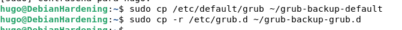
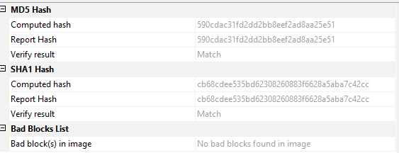

author: Hugo Flores
summary: Guía de bastionamiento de Debian 13
id: 1
categories: codelab,markdown
environments: Web
status: Published
feedback link: Un enlace en el que los usuarios puedan darte feedback (quizás creando un issue en un repositorio de git)
analytics account: ID de Google Analytics
# Guia de bastionamiento de arranque de Debian 13
---

## Paso 1: Identificación del equipo
Lo primero que vamos a hacer, es realizar fotografías del entorno, como:
- Estado de la máquina (si está encendida o mal apagada)
- Procesos de la máquina
- Conexiones de red
- Dispositivos conectados

Ejemplo:
```
Fecha/Hora: 11/11/2025, 09:30 CET
Ubicación: Sala servidores S-203, Edificio Principal
Descubierto por: JHugo Flores Molina (DNI: 12345678A)
Circunstancias: Alerta IDS Snort ID-2025-8847


```

Después registraremos las especificaciones de la máquina

| Característica      | Detalle                             |
| ------------------- | ----------------------------------- |
| Sistema Operativo   | Windows 7 Professional 64-bit |
| Capacidad Disco     | 32GB                                |
| Memoria RAM         | 1GB                                 |
| Sistema de Archivos | NTFS                                |
| Hipervisor          |  VirtualBox                          |
| Estado Inicial      | Sistema mal apagado, red encendida   |

---

## Paso 2: Adquisición de evidencias volátiles

## 2.1 Preparación del entorno
Inmediatamente después de que encendamos nuestro equipo, para la adquisición de la memoria volátil (RAM), conectaremos una memoria USB que contenga el programa "FTK Imager". Es importante de que nuestro USB esté cifrado con un algoritmo fuerte (AES-256) y que esté libre de cualquier tipo de malware, para evitar alterar las pruebas de la máquina.

## 2.2 Captura de memoria RAM
Ahora, para hacer la captura correctamente, abriremos FTK Imager en nuestra memoria USB (SIEMPRE HAY QUE EJECUTARLO AHÍ, PARA EVITAR ALTERACION DE PRUEBAS)


---

## Paso 3: Copia de seguridad de la configuración del arranque

Antes de modificar nada del GRUB, crearemos copias de seguridad. Se realiza en el caso de que hagamos errores al modificar las opciones de arranque y poder recuperar rápidamente la funcionalidad del equipo. Si se comete un error en el GRUB, puede dejar el sistema inutilizable.

**Podemos realizar los comandos siguientes para el backup del GRUB:**

```
sudo cp /etc/default/grub ~/grub-backup-default
sudo cp -r /etc/grub.d ~/grub-backup-grub.d
```


**Y Para restaurar:**

```
sudo cp ~/grub-backup-default /etc/default/grub
sudo cp -r ~/grub-backup-grub.d/* /etc/grub.d/
sudo update-grub
```


---

## Paso 4: Otras opciones de seguridad

- **Contraseña BIOS/UEFI:** Como en el proyecto anterior, podemos introducir la contraseña de administrador y usuario de la BIOS para mayor seguridad ante intento de acceso físico.

- **Secure Boot:** Esta opción hace de que si queremos arrancar algo, deba estar firmado digitalmente para evitar la carga de software desconocido o malicioso por parte del atacante.

- **Cifrado completo de disco:** Durante la instalación de Debian, podemos elegir cifrar el disco duro con LVM, además de poder hacerlo con las propias particiones separadas (/home,/var...)

---