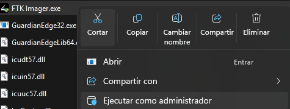
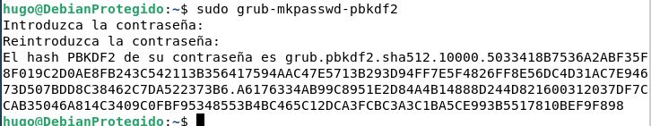
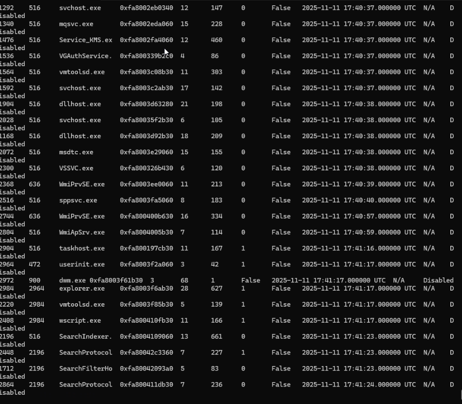
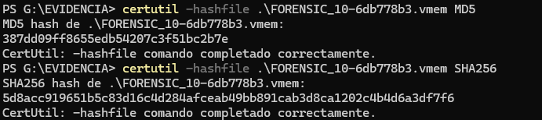

author: Hugo Flores
summary: Guía de bastionamiento de Debian 13
id: 1
categories: codelab,markdown
environments: Web
status: Published
feedback link: Un enlace en el que los usuarios puedan darte feedback (quizás creando un issue en un repositorio de git)
analytics account: ID de Google Analytics
# Guia de adquisición forense con FTK Imager en una máquina Win7
---

## Paso 1: Identificación del equipo
Lo primero que vamos a hacer, es realizar fotografías del entorno, como:
- Estado de la máquina (si está encendida o mal apagada)
- Procesos de la máquina
- Conexiones de red
- Dispositivos conectados

Ejemplo:
```
Fecha/Hora: 11/11/2025, 09:30 CET
Ubicación: Sala servidores S-203, Edificio Principal
Descubierto por: JHugo Flores Molina (DNI: 12345678A)
Circunstancias: Alerta IDS Snort ID-2025-8847


```

Después registraremos las especificaciones de la máquina

| Característica      | Detalle                             |
| ------------------- | ----------------------------------- |
| Sistema Operativo   | Windows 7 Professional 64-bit |
| Capacidad Disco     | 32GB                                |
| Memoria RAM         | 1GB                                 |
| Sistema de Archivos | NTFS                                |
| Hipervisor          |  VirtualBox                          |
| Estado Inicial      | Sistema mal apagado, red encendida   |

---

## Paso 2: Adquisición de evidencias volátiles

## 2.1 Preparación del entorno
Inmediatamente después de que encendamos nuestro equipo, para la adquisición de la memoria volátil (RAM), conectaremos una memoria USB que contenga el programa "FTK Imager", siguiendo la norma NIST SP 800-86, siguendo el principio de orden de volatibildad.

La memoria RAM contiene evidencias importantes que se perderían al apagar bien el equipo: procesos, conexiones, claves de cifrado y código malicioso.

## 2.1.1 Uso de la memoria USB
Es importante de que nuestro USB esté cifrado con un algoritmo fuerte (AES-256) y que esté libre de cualquier tipo de malware, para evitar alterar las pruebas de la máquina. Para esta adquisición utilizaremos un SSD PNY CS900 de 240 GB conectado a un convertor SATA a USB, revisado ante amenazas y cifrado con Veracrypt.

## 2.2 Captura de memoria RAM
En este caso, nuestra máquina da problemas al ejecutar FTK Imager, debido a la falta de librerías esenciales para su funcionamiento, además de probar con otros programas como Dumpit y no tener suerte, se explicará el procedimiento para poder replicarse correctamente. Después se probó con Volatility3 y se pudo sacar los procesos de la máquina correctamente

- Insertamos nuestra memoria USB sin ejecutarla inmediatamente
- Navegamos a la carpeta instalada de FTK Imager


- Ejecutamos FTK Imager.exe como administrador (clic derecho + Ejecutar como administrador )



- Ahora, para capturar la memoria de la máquina (si funcionara...), nos vamos a File > Capture Memory


 - Al seleccionar la opción, nos pedirá que eligamos la ruta para el dump de la memoria. Al elegirlo, le damos clic a Capture Memory y esperamos a que se realize.



- Al terminar la captura, nos debería generarse un archivo .dmp, y con Votality, podemos saber los procesos que ejecutaba la máquina. Para ello, introducimos en el cmd:
```
 .\vol.py -f .\FORENSIC_10-Snapshot1.vmem windows.pslist

 ```
 Nota: El proceso se realiza muy rápido, por lo que se recomienda grabar pantalla para poder capturar correctamente los procesos (para ello es la opción windows.pslist)



- MUY IMPORTANTE: Hay que realizar un hash inmediato de la RAM obtenida para garantizar que no se alteren los datos con su uso (ya sea con MD5 o SHA-256)




---

## Paso 3: Adquisición de evidencias no volátiles

## 3.1 Disco duro
## 3.1.1 Apagado controlado del sistema
Antes de proceder con la adquisición del disco, ejecutaremos un apagado ordenado del sistema para evitar problemas de corrupción de datos Desde CMD con privilegios de administrador ejecutaremos:​

```
shutdown /s /t 0
```

Documentaremos la hora exacta del apagado (11/11/2025 19:37 CET). Evitaremos el uso del botón de apagado físico o cierre abrupto de la VM que podría perder datos en caché.​

## 3.1.2 Adquisición forense bit-a-bit
Para realizar la adquisición es imprescindible hacer una copia bit-a-bit del disco duro para asegurarnos de que la evidencia original no sea modificada. Utilizaremos FTK Imager como herramienta para crear una imagen completa del disco virtual de 32 GB

- Iniciaremos FTK Imager en nuestra estación forense y seleccionaremos File > Create Disk Image. En el cuadro de diálogo "Select Source", elegiremos la opción "Physical Drive" para capturar el disco completo sector por sector incluyendo espacio no asignado y archivos eliminados.
- En nuestro caso utilizaríamos "File Image", ya que al tratarse de una VM, debemos coger la imagen de la propia máquina. Se haría con "Add Evidence Item - Image File", elegimos la imagen de la VM a analizar y al dar clic a Finish, nos debería salir el disco completo

- Ahora, para hacer la copia completa del disco, nos vamos a "File - Create Disk Image", elegimos la imagen de nuestra VM, e introducimos la siguiente información en los parámetros:

```
Evidence Item Information:
- Case Number: FOR-2025-1111-W7-HFM
- Evidence Number: EVI-001-DISCO-PRINCIPAL
- Unique Description: Disco sistema Windows 7 comprometido - Ransomware
- Examiner: Hugo Flores Molina
- Notes: VM VMWare - Alerta 2025-8847

Image Destination Folder: E:\Evidencia\
Image Filename: WIN7_COMP_32GB_20251111
Image Fragment Size: 2000 MB (2 GB por segmento)

☑ Verify images after they are created
☑ Create directory listings of all files

```


NOTA IMPORTANTE: También para esta sección he elegido verificar la imagen con hash tanto de MD5 y SHA256 para garantizar que no haya cambios.


```
sudo cp /etc/default/grub ~/grub-backup-default
sudo cp -r /etc/grub.d ~/grub-backup-grub.d
```


**Y Para restaurar:**

```
sudo cp ~/grub-backup-default /etc/default/grub
sudo cp -r ~/grub-backup-grub.d/* /etc/grub.d/
sudo update-grub
```


---

## Paso 4: Otras opciones de seguridad

- **Contraseña BIOS/UEFI:** Como en el proyecto anterior, podemos introducir la contraseña de administrador y usuario de la BIOS para mayor seguridad ante intento de acceso físico.

- **Secure Boot:** Esta opción hace de que si queremos arrancar algo, deba estar firmado digitalmente para evitar la carga de software desconocido o malicioso por parte del atacante.

- **Cifrado completo de disco:** Durante la instalación de Debian, podemos elegir cifrar el disco duro con LVM, además de poder hacerlo con las propias particiones separadas (/home,/var...)

---